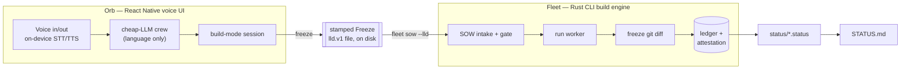

# Light — voice-native build loop (Orb × Fleet)

Say what you want built. **Orb** hears it and turns it into a frozen spec. **Fleet** builds it,
verifies it, and hands back a signed receipt. One independent monorepo root (decision **D15**,
2026-09-07) — no dependencies outside this directory.

## What it is

| Piece | Path | Role |
|---|---|---|
| **Orb** | `orb/` | React Native voice companion. On-device STT/TTS, a cheap-LLM crew that only fills language (never decides state), and a build-mode session that ends in a stamped **Freeze**. |
| **Fleet** | `fleet/` | Local macOS CLI build engine. Turns a Freeze into a SOW, runs the worker, freezes the git diff, writes a tamper-evident receipt. |
| **Handoff** | `docs/lane-contracts/F09-orb-fleet-handoff.md` | The only contract between the two: a keel-stamped `Freeze` (`lld.v1` file, on disk). Keel — Fleet's gate — is the sole writer of `stamped_by`; Orb's Python never stamps. |

## HLD



## Layout

```
Light/
├── orb/                 voice app — copied from company/products/adhd-focus-orb
├── apps/macos/          macOS host — copied from adhd-focus-orb/macos/OrbMac
├── fleet/               build engine — copied from fleet-rs/
│   └── registry-reference/  shell-script reference for Light/fleet's /task workflow shape
├── registry/{features,services,modules}/  scaffold, populated by extraction as features land
├── FEATURES.md          atomic feature list, ordered by time-to-visible-output
├── STATUS.md            generated — do not hand-edit (status/render.sh)
└── status/               one .status file per feature (status/CONVENTION.md)
```

Provenance: each subtree was copied (not moved) from its source repo via
`git ls-files -co --exclude-standard`, so regenerable artifacts (`node_modules`, `.venv`, `target`,
build caches) were left behind and every source repo is untouched as the rollback path. `Light/` has
its own fresh git history rather than three nested ones, so a `git worktree add`-per-feature workflow
has one coherent repo to branch from.

## Quickstart

```sh
cd orb && npm install && npm run verify   # boundary-lint + typecheck + TS/Python/Rust tests
cd fleet && ./install.sh && fleet status  # builds + installs the Rust CLI
```

## Reading order

1. This file → [`FEATURES.md`](FEATURES.md) → [`STATUS.md`](STATUS.md).
2. `blueprints/Speed-of-Thought-L8-Deep-Dive/README.md` + `ORB-AND-FLEET-DELTA.md` — the LLD this
   build follows.
3. [`docs/lane-contracts/`](docs/lane-contracts/) and [`docs/evidence/`](docs/evidence/) — one
   contract and evidence file per shipped feature.
