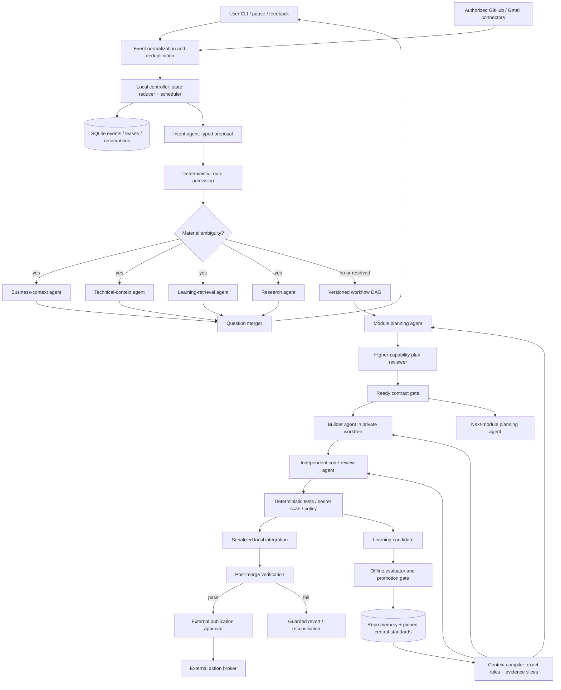
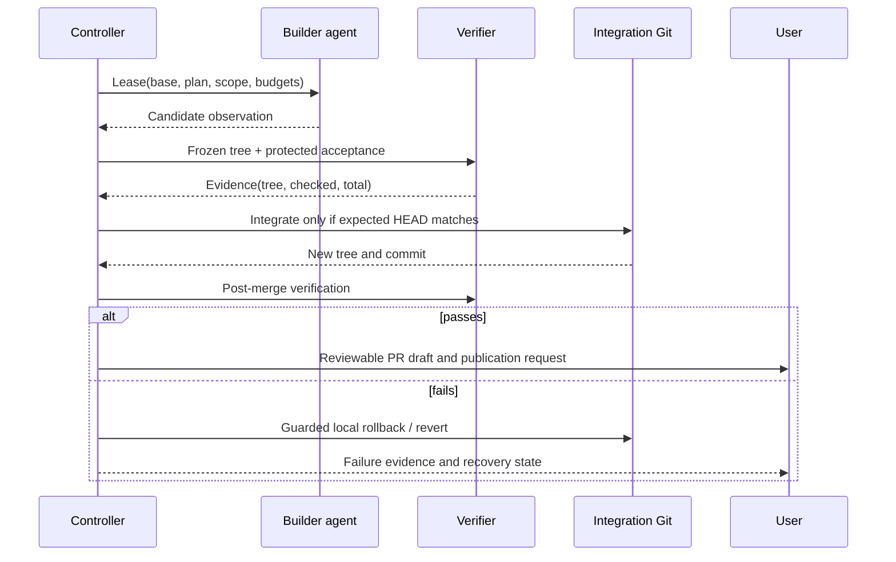

# Fleet: local CLI SDLC harness — comprehensive low-level design

Status: **proposed design for review, not an implementation or production-readiness claim**. Research checked 2026-09-11. Repository snapshot: `82454636847ddd2bc8b2e8aa6dc463a822f14bf6`. Scope: the 46 requirements supplied in goal-objective.md. All numbers below are proposed engineering budgets unless explicitly labelled measured. No runtime, acceptance tests, or JSON contracts are changed by this document.

**Decision:** retain a small deterministic local controller; adopt existing CLI execution protocols, sandbox primitives and MCP SDKs. Models propose intent, plans, patches and lessons. Fleet alone authorizes effects, reserves budgets, schedules work, validates evidence, integrates changes and promotes policy. Output quality is Fleet's acceptance responsibility; model completion text is never proof.

**User-selected default:** build and verify autonomously; stop before any external publication. A draft PR, push, central-learning upload, email and external notification all count as external effects and need a configured grant or user approval. Local preparation and local verification proceed. Approval binds the exact action, destination and content digest; unrelated later edits invalidate it.

Read sections 1–4 for the main decisions; sections 5–21 specify implementation contracts; sections 22–26 cover research, rollout, requirements trace and verification. The accompanying [interactive graph](../design/fleet-harness/system-graph.html) is an overview; [`lld-full-detail.html`](lld-full-detail.html) is the full component-level companion (32 nodes, matches §3/§4 1:1). The diagrams and contracts below are the detailed authority for this proposal.

**Rigor-gap closure, 2026-09-11:** an owner review found that several gating decisions used an undefined qualitative term ("material," "risk low," "demonstrated performance") as the actual admission test, with no threshold, formula, or independent check behind it. §6 (×2), §7, §9, §12, §16 (×2), §17 (×2), §18 and §19 (×2) below each now carry a marked **Gap closure** paragraph giving the concrete rule. A second, independent multi-agent review on the same date checked this closure and the document's own §24 trace for remaining thin spots and one outright wrong claim (an earlier version of this note misattributed one closure to §9 when it was in §7 — fixed here, and a real §9 closure added below since none existed). This does not change the document's overall proposal status — these are still design-level rules, not measured or implemented.

## 1. Product boundaries and decisions to debate

| Decision | Proposed default | Why / trade-off | Revisit when |
|---|---|---|---|
| Runtime ownership | Local Rust controller with SQLite and supervised subprocesses | Durable authority without a hosted control plane; modest idle footprint | A measured local bottleneck requires another process |
| Agent integration | ACP first where conformance passes; native structured adapters next | Reuse existing agents, authentication and tools; capability gaps remain explicit | An adapter cannot enforce a required property |
| Workflow | A versioned typed task DAG selected per intent | Supports questions, diagnosis, review and implementation without forcing a planning ceremony | Recurring workflows reveal reusable recipes |
| Safety and quality | Deterministic admission, isolated workers, independent evaluation | Higher latency than accepting agent prose; prevents unsafe success claims | Never waive invariants for speed |
| Learning | Propose locally, evaluate offline, promote within approved bounds | Slower adaptation than live self-editing; stable authority and rollback | A candidate proves benefit on held-out tasks |

“Any CLI” means discover arbitrary installed candidates and report compatibility, not guarantee automation of an arbitrary terminal UI. “Keyless” means no new Fleet API key when an existing CLI can reuse its authorized account; it does not mean free, anonymous, or unlimited. New MCP services may need separate login. Fleet must never evade account quota or provider access rules.

“Regardless of scale” means bounded working sets, pagination, hierarchical decomposition and disk admission. It cannot mean lossless compression of arbitrary information into a fixed prompt. “Never repeat a mistake” becomes an observable recurrence metric and a regression fixture, not a promise that a model can never err.

“Work for days” means persistent jobs that survive restarts and deliberate waits. It does not keep a laptop awake without an explicit preference or imply continuous execution while the machine sleeps. Remote inference and authorized external connectors are compatible with a local control plane; no hosted Fleet service is required.

## 2. Non-functional requirements and acceptance budgets

Default reference profile: a 16 GiB laptop also running user applications, remote model inference, two agent lanes maximum, one compiler/test-heavy job. A smaller machine selects the constrained profile before dispatch. Metrics exclude external latency only where explicitly stated.

| ID | Requirement / proposed target | Measurement and failure behavior |
|---|---|---|
| N01 | Controller idle RSS ≤128 MiB; active P95 ≤256 MiB | Sample process RSS each second during a defined 30-minute workload; publish samples checked/total |
| N02 | Supervised process-tree RSS soft budget 2 GiB; constrained profile 768 MiB and one lane | Includes agents, MCP children and tests; exclude only separately declared inference. Refuse work whose reservation will not fit. A compiler may require an explicit larger profile |
| N03 | Idle CPU ≤1% of one core averaged over 5 minutes; at most two CPU-heavy jobs, default one | Measure CPU time/wall time; debounce watchers, avoid idle polling loops |
| N04 | Local durable request acknowledgement P95 <100 ms; ready-node scheduling P95 <100 ms at 100 events/s | No model, network or full index rebuild in acknowledgement path; benchmark 10,000 events with latency histogram |
| N05 | Warm lexical retrieval P95 <250 ms for 100,000 chunks; cold indexing budget 60 s per 10,000 small files | Targets, not current results; partial indexes must expose coverage and freshness |
| N06 | Bounded state 2 GiB; worktrees 4 GiB; shared build cache 4 GiB as separate visible soft budgets | Total can reach 10 GiB. Refuse new work earlier if free disk minus reservations would fall below 2 GiB |
| N07 | An acknowledged local state transition survives process kill | SQLite FULL durability on local storage; fault-inject after every durable boundary. Hardware/filesystem failure remains separate |
| N08 | Recovery starts eligible local work within 30 s of restart at 100,000 events | Checkpoint + bounded replay; incomplete external effects enter reconciliation, not blind replay |
| N09 | Pause acknowledged locally <250 ms; no new leases after acknowledgement | Active external actions may finish; cooperative checkpoint deadline 10 s, forced process-tree stop after 30 s when supported |
| N10 | No required gate passes with checked=0 or checked<total | Missing, skipped, malformed and stale evidence block acceptance; publish explicit applicable-input set |
| N11 | Privileged writes require a valid capability and matching resource version | Real child escape/denial tests on every supported OS; unsupported sandbox means reduced compatibility tier |
| N12 | Every route and refusal has a durable explanation and evidence references | Disk-full handling uses preallocated emergency receipt capacity; if that also fails report unrecorded fatal state and exit 3, never success |
| N13 | Sensitive data absent from default telemetry and external summaries | Redaction fixtures and credential isolation; false negatives remain an explicit scanner limitation |
| N14 | 72-hour unattended soak with controlled quota, sleep/restart and connector faults | Report accepted/scheduled work and recovered/injected faults; one successful soak is qualification, not a reliability guarantee |
| N15 | Backward-readable event records across one schema migration; transactional migration and restore test | Backup before migration; refuse unsupported future versions, never silently coerce |
| N16 | Every quality claim scoped by task type, model version and evidence cohort | No ranking with unknown model identity or missing outcomes; immature candidates remain probationary |
| N17 | Cancellation and terminal failure clean up owned temporary resources within 60 s when no readers hold them | Preserve unique patches and pinned evidence; cleanup backlog and failures remain visible |
| N18 | Accessibility: text-first terminal, keyboard operation, no required animation, redacted explain view | Test CLI paths with real binary; visual artifact supplements text, never replaces it |

Hard invariants are not P95 targets. Safety applies to every mediated operation. RSS and CPU ceilings are targets until an OS-specific limiter is installed and tested; sampling alone cannot prevent a fast allocation spike.

## 3. Architecture and authority boundaries



Each agent box is a role instance, not a mandatory separate resident model. Fan-out is available at any DAG layer but bounded by dependencies, resources and useful parallel work. The simplified interactive graph shows principal roles; this graph includes ambiguity and learning lanes.

Trust zones: (1) operator-approved controller/config/grants; (2) immutable observed evidence; (3) untrusted worker and retrieved content; (4) external providers. Models cannot write the controller database, ledger, credential store, approved policy, integration Git metadata or acceptance authority. Worker result claims are observations until the parent validates them.

A worker environment contains neither ledger path, state directory nor controller socket. The Fleet result channel is inherited fd 3 with bounded frames. Provider protocol stdout is consumed by the trusted adapter supervisor, normalized, and delivered to the parent; worker stdout/stderr are diagnostics, not alternative authority. OS sandboxing must also deny discoverable authority paths; hiding environment variables alone is insufficient. Worker ToolRequest/ToolResult frames are multiplexed through the same inherited fd 3 channel (a framed duplex socketpair), and the trusted supervisor alone speaks MCP to servers. A protocol adapter must bridge native requests into that channel; no worker receives a second Fleet socket or broker credential. Native CLIs with unavoidable direct tool/effect channels cannot qualify for this strict tier. Provider inference transport must likewise be brokered where the fd-3-only rule applies; otherwise the adapter is explicitly incompatible with that profile. This is an adoption gate, not a claim all current CLIs support such mediation.

## 4. Responsibility layout and adoption boundaries

Existing Cargo workspace names are useful seams, not evidence that this entire design is built. The graph index was available and used to inspect routing; the raw source was then checked at the recorded revision.

| Component | Responsibility | Input → output | Owned effects |
|---|---|---|---|
| fleet-types | Versioned envelopes, typed IDs, integer units | Validated JSON → domain values | None; contract edits need ADR |
| fleet-events | Poll/webhook normalization, replay guard | Connector envelope → accepted event | Through store transaction only |
| fleet-lifecycle | Pure transition reducer | State + event → state + effect intents | None |
| fleet-router | Capability/policy/budget eligibility and ranked decision | Immutable runtime snapshot → decision/refusal | None |
| fleet-scan | Conditional ambiguity probes and evidence coverage | Intent + unknowns → ambiguity records | Bounded read/research jobs |
| fleet-plan | Typed blueprints, readiness, walkthroughs | Requirements + evidence → plan proposal | Versioned draft artifacts |
| fleet-context | Retrieval, dependency expansion, packing | Query + source snapshot + budget → manifest | Derived indexes via store ports |
| fleet-worker | Protocol adapters, launch, cancel and result normalization | Lease + compiled context → observations | Sandboxed children only |
| fleet-govern | Admission, grants, quotas, retry state and runtime health | Snapshot + requested effect → permit/refusal | Parent-mediated effects |
| fleet-verify / fleet-judge | Deterministic checks / advisory model critique | Exact candidate digest → evidence | Isolated verification jobs |
| fleet-merge | Worktree ownership, integration serialization, rollback | Verified candidate + expected HEAD → integration receipt | Controller-owned Git operations |
| fleet-memory | Lessons, applicability, proposals and offline score snapshots | Evidence → candidate → validated learning | No direct policy activation |
| fleet-store | SQLite transactions, artifacts, retention and backup | Typed records → durable references | Sole authority writer |
| fleet-stream / src | Human CLI, progress projection and composition | Commands/events → presentation | Wiring, not business decisions |

Adopt SQLite/FTS5, existing Git, an official MCP SDK, maintained sandbox facilities, provider-native transports and established secret/static analyzers after exact-version smoke tests. Do not write a new hash implementation, OAuth stack, terminal emulator, distributed queue, local inference engine or universal LLM framework. Reuse existing retrieval implementations where measured; this proposal does not replace the current context crate merely to standardize on another library.

## 5. Runtime data model

Identifiers are opaque strings; monetary values are signed/unsigned checked integers in currency microunits, never binary floats. Token counts and byte counts are integers. Unknown remains null with a reason. Hashes are fixed algorithm-tagged strings. Parent timestamps use wall clock for audit and monotonic elapsed time for live deadlines; persisted deadlines are reconsidered after clock changes.

```text
Request {id, source, actor, text_ref, repos[], received_at, authorization_ref?}
IntentSpec {id, version, kind, goal, constraints[], unknowns[], risk,
            acceptance_refs[], requested_effects[], evidence_refs[]}
PlanVersion {id, parent_id?, intent_digest, policy_digest, standards_digest,
             modules[], questions[], acceptance_digest, status}
TaskNode {id, run_id, plan_version, kind, task_type, repo_ids[], dependencies[],
          read_set[], write_set[], contract_digests[], acceptance_refs[],
          required_capabilities[], quality_profile, budgets, state}
Lease {id, node_id, attempt_id, generation, expires_at, expected_repo_heads,
       effective_grant_digest, context_digest, adapter_snapshot_digest}
WorkerObservation {lease_id, sequence, kind, bounded_payload_ref}
GateEvidence {id, evaluator_version, input_tree_digest, checked, total,
              verdict, exit_code, evidence_refs[], policy_digest}
EffectIntent {id, idempotency_key, kind, destination, content_digest,
              expected_resource_version?, grant_id, state}
RouteDecision {id, snapshot_digest, candidates[], rejection_reasons[],
               selected_id?, score_components, reservation_id?, explanation}
```

Worker schemas exclude authoritative actor, timestamp, resolved model, approval and budget settlement fields. If a worker sends them, reject the frame rather than ignore ambiguous authority claims. Protocol frame: version, sequence, kind, payload length, JSON; maximum 1 MiB/frame, 8 MiB queued per worker, larger data goes through a bounded artifact intake operation. Unexpected sequence gaps or duplicate terminal frames are protocol faults with receipts.

Proposed SQLite schema, expressed compactly for review; real migration DDL needs foreign keys, CHECK constraints, indexes and migration tests:

```sql
CREATE TABLE runs(id TEXT PRIMARY KEY, state TEXT NOT NULL, revision INTEGER NOT NULL,
  plan_digest TEXT, policy_digest TEXT NOT NULL, checkpoint_seq INTEGER NOT NULL);
CREATE TABLE events(run_id TEXT NOT NULL, seq INTEGER NOT NULL, event_id TEXT UNIQUE NOT NULL,
  schema_version INTEGER NOT NULL, kind TEXT NOT NULL, payload_ref TEXT NOT NULL,
  previous_digest TEXT, digest TEXT NOT NULL, PRIMARY KEY(run_id,seq));
CREATE TABLE nodes(id TEXT PRIMARY KEY, run_id TEXT NOT NULL, state TEXT NOT NULL,
  revision INTEGER NOT NULL, plan_digest TEXT NOT NULL, spec_ref TEXT NOT NULL);
CREATE TABLE leases(node_id TEXT PRIMARY KEY, attempt_id TEXT UNIQUE NOT NULL,
  generation INTEGER NOT NULL, expires_at TEXT NOT NULL, spec_ref TEXT NOT NULL);
CREATE TABLE reservations(id TEXT PRIMARY KEY, run_id TEXT NOT NULL,
  units INTEGER NOT NULL CHECK(units>=0), unit_kind TEXT NOT NULL, status TEXT NOT NULL);
CREATE TABLE effects(id TEXT PRIMARY KEY, idempotency_key TEXT UNIQUE NOT NULL,
  state TEXT NOT NULL, grant_digest TEXT NOT NULL, request_ref TEXT NOT NULL, result_ref TEXT);
CREATE TABLE inbox(source TEXT NOT NULL, delivery_id TEXT NOT NULL, payload_digest TEXT NOT NULL,
  accepted_event_id TEXT NOT NULL, PRIMARY KEY(source,delivery_id));
CREATE TABLE outbox(id TEXT PRIMARY KEY, effect_id TEXT UNIQUE NOT NULL,
  next_attempt_at TEXT NOT NULL, attempts INTEGER NOT NULL CHECK(attempts>=0));
```

Also store repo_heads, gates, usage_observations, model_snapshots, learning_candidates, policy_versions, artifacts and pins. Index events(run_id,seq), nodes(run_id,state), outbox(next_attempt_at), memory(scope,task_type,status,expires_at). Lease generation fences stale workers even if an old process returns after timeout.

Each transition uses one transaction: validate expected revision → reserve budget/resources → append event → update projection → create effect/outbox row → commit. Only then launch side effects. Materialize large blobs first into a temporary file, hash and fsync, publish atomically without replacing an existing content address, verify any existing blob has the expected digest, fsync the destination directory, then commit references. Readers acquire transactional artifact pins before resolving a reference and release them after closing the file; GC rechecks pin generation before deletion. A crash can leave an unreferenced blob, which GC may remove; it must never leave a referenced incomplete blob.

## 6. Intent, ambiguity and workflow selection

Use a cheap deterministic front door for explicit commands, pause/resume and obvious read-only requests. For natural language, an intent agent emits schema-constrained IntentSpec with source evidence and uncertain fields. The controller validates effects, ambiguity and workflow eligibility. Do not trust a model's self-reported confidence as calibrated probability.

**Gap closure — independent check on `kind`:** a bare model call choosing `kind` from nine workflow types is a single point of failure with no independent check, unlike every other risky decision point in this design. Alongside the intent agent, compute a second, deterministic candidate `kind` from cheap signals already available before dispatch: explicit imperative verbs and file/path references in the raw request, whether the request cites existing acceptance criteria or test IDs, and whether the union of `requested_effects` the model proposed is read-only under the repo's static permission model. If the deterministic candidate and the model's `kind` disagree, do not trust the model's choice outright: downgrade to whichever of the two implies the more conservative workflow (`review-only` over `small-change`, `small-change` over `feature`, any named workflow over an unrecognized one) and persist a disagreement receipt naming both candidates. Agreement is not required to proceed; silent adoption of the riskier candidate on disagreement is what this closes.

Initial workflow kinds: answer/explain, investigate, review-only, small-change, feature, refactor, incident, multi-repo-change, research/design. Extension IDs are namespaced strings with schema versions and declared handler contracts. Unknown workflows may run a bounded read-only classification probe; if still unknown, ask one concrete question and persist a refusal/wait receipt. Never silently route an unknown request into code mutation.

| Path | Minimum flow | Planning decision |
|---|---|---|
| Answer / explanation | Retrieve → answer with evidence | No blueprint unless requested |
| Review-only | Freeze target → inspect → findings | No code changes without scope change |
| Small change | Exact task contract → build → verify → local integration | Skip full module design when risk low, scope bounded and oracle clear |
| Investigation | Reproduce → hypotheses → bounded experiments → diagnosis | Repair is a separate authorized successor |
| Feature / refactor | Ambiguity scan if needed → reviewed module contracts → overlap build/planning | Full planning for cross-cutting or irreversible choices |
| Incident | Contain within grant → collect evidence → diagnose → repair/rollback | Emergency profile changes latency budget, not authority |
| Multi-repo | Dependency graph → compatibility plan → per-repo candidates → coordinated verification | Required, because release order and compensation matter |

Planning is skipped only when all hold: acceptance is explicit, effects are authorized, risk is low, write scope is bounded, no unresolved cross-repo interface, and no material ambiguity (§6 gap closure gives the checkable predicate for "material"). The threshold (for example at most three files) is a configurable heuristic, never sufficient by itself. A one-line credential or migration change can still be high risk.

**Gap closure — what "risk is low" means:** use the same risk tiering §17 defines for profile selection (low / medium / high, driven by effect class and path sensitivity), not an independent judgment here. A task is eligible to skip planning only at risk tier `low` as §17 computes it; `medium` or `high` always gets at least the small-change contract path, regardless of file count.

Ambiguity record: field, alternatives, evidence, impact_if_wrong, resolvable_by_tool, dependency_nodes, question. Spawn only probes connected to a material unknown; do not launch four research agents for a spelling fix.

**Gap closure — what "material" means:** an unknown is material, and only then earns a probe or a question, iff at least one holds: (a) resolving it differently would change the `requested_effects` set (a different effect class, a different target repo, read vs. write); (b) it would change which `acceptance_refs` apply; (c) it touches an effect class for which no grant is currently held; or (d) its `dependency_nodes` include a task that is already ready or scheduled, i.e. it is actively blocking real work. An unknown failing all four is cosmetic (naming, formatting, comment style) and gets no probe, no question, and no planning delay. This is a checkable predicate over fields the ambiguity record already carries, not a new field. Independent probes can run concurrently with deadline 20 s for local reads and a configurable 90 s research budget. Probe timeout is missing evidence, not “no ambiguity.” Merge duplicate questions; prioritize those that unblock the most work. Ask at most three concise questions per interaction, retain answer-to-plan provenance, continue unaffected DAG nodes.

## 7. Plan contracts, readiness and teaching

Module contract contains purpose, functional/non-functional requirements, exact acceptance criteria, API/schema contracts, write-set, dependency versions, rollout/rollback, observability and failure cases. A stronger reviewer means a model with demonstrated performance in this task class, not just an expensive alias. If no eligible reviewer meets the configured threshold or independence rule, wait or request a human review; never relabel a weaker route.

**Gap closure — what "demonstrated performance" means:** a model qualifies as reviewer for a task class only if it has at least a configured minimum number of fresh, independent trials in that class (§18's trial record) with first-pass acceptance at or above the configured floor for that class. A task class with no cohort yet — too new to have evidence — has no qualified model reviewer at all: route to a human review or the single highest tier in this section's qualification table, never to a model chosen merely because it is available. Cohort size and floor are configuration, not invented per review; §17's "insufficient evidence" rule governs when the floor cannot be checked.

Readiness predicate:

```text
ready(module) = acceptance_nonempty
  AND all_blocking_questions_resolved
  AND reviewer_accepts(plan_digest)
  AND dependency_contracts_pinned
  AND grants_cover_effects
  AND write_scope_exclusive
  AND budget_and_resources_available
```

Planner N+1 may run while Builder N executes if N's contract is immutable and N+1 cannot write anything N builds or measures. If feedback changes a shared contract, create plan version V+1 and mark affected descendants stale. Stop dependent admission, preserve existing patches, rebase/replan only affected work. Approval and review of V do not automatically apply to V+1.

Teach-back is a structured projection: what changes, why, key trade-off, concrete example, evidence, unresolved decision. At module readiness and PR preparation, explain before/after behavior and how tests establish it. Stream milestone updates, not raw reasoning or token chatter. User corrections create versioned feedback events and new validation work; never overwrite prior explanations to hide a changed decision.

## 8. Scheduling, fan-out and resource allocation

Maintain adjacency lists, indegree counts and a priority heap of ready nodes. Detect cycles on plan insertion in O(V+E). Decrement successor indegrees only after an accepted dependency event; speculative work cannot satisfy a required dependency. A graph rewrite has its own revision and invalidation set.

Scheduling score is deterministic given a stored snapshot: critical-path rank, waiting age, number of blocked successors, user priority and estimated resource cost. Use integer scaled scores with stable task-ID tie break. Reserve a reviewer slot or give review higher priority so builders do not fill all slots and strand completed patches. No nested agent process can recursively consume unreserved Fleet lanes; adapter-internal fan-out must be disabled or charged to the enclosing reservation.

```text
while ready_heap not empty:
  node = pop_next_fair_candidate()
  if conflicts(node.read_set, node.write_set, active_leases): defer(node)
  routes = eligible_routes(node, capability_snapshot, grants)
  if routes empty: persist_refusal_or_wait(node); continue
  selected = choose_within_quality_latency_cost_bounds(routes)
  transactionally reserve tokens, money_if_known, RAM, CPU, disk, worktree
  compare_and_swap node.revision and issue generation-fenced lease
  launch after durable commit
```

Conflict predicate: for distinct live nodes i,j, Wi∩Wj, Wi∩Rj and Wj∩Ri must all be empty for mutable shared inputs. Immutable commit snapshots can be read concurrently. Integration refs, lockfiles, generated schemas and shared build caches are resources too; separate worktrees alone do not make them independent. Dynamic discovery outside the lease stops the worker for lease expansion and re-evaluation.

Concurrency = min(user lane cap, adapter cap, RAM admission, CPU admission, available independent nodes, review capacity). At 2 GiB child budget, two measured 600 MiB agent trees leave 848 MiB; a 1.2 GiB build cannot run alongside both. Either reduce to one agent or defer the build. Use historical P95 demand plus margin; on first use start serially and measure. Controller state memory scales with active frontier, not total history.

Retries: environment repair budget two attempts for classified transient faults; verification repair budget two attempts; the third recurrence of the same failure signature stops automatic guessing and asks one diagnostic question. Provider retry-after and exponential backoff with bounded jitter govern quota/network retries. A non-idempotent action with unknown completion is reconciled before another attempt.

## 9. Agent discovery, model catalog and compatibility

Discovery searches explicit configured paths and trusted PATH entries, captures canonical executable path/version/digest, then performs a bounded noninteractive protocol probe. Do not execute every file on PATH. A candidate registry or user-approved executable hint identifies plausible agents; unknown binaries remain untrusted until installation provenance and launch permission are established. Installation/login is not automatic merely because discovery found a candidate.

Adapter interface:

```text
probe(executable, timeout) -> CapabilityReport
list_models(session) -> ModelCatalogObservation | Unsupported
start(Lease, ContextManifest, ProtocolConfig) -> SessionHandle
send_input(session, versioned_feedback) -> Ack
cancel(session, deadline) -> CancelReceipt
checkpoint(session) -> NativeCheckpointRef | Unsupported
normalize(provider_event) -> Observation | ProtocolFault
reconcile(session, effect_id) -> EffectState | Unknown
```

Capability report records structured output, requested/resolved model identity, supported effort settings, context limit/tokenizer, usage fields, cancellation, session resume, tool mediation, MCP injection, permission controls, sandbox compatibility, hidden startup hooks and internal fan-out controls. Every property is supported, unsupported or unknown with evidence timestamp and CLI version.

| Tier | Qualification | Eligible use |
|---|---|---|
| Managed protocol | ACP/native protocol + tested isolation and effect mediation | Autonomous building within grants |
| Structured batch | Noninteractive JSON events, limited resume/tools | Bounded jobs; restart from Fleet checkpoint |
| Opaque terminal | Text-only UI or unobservable permission effects | Human-assisted/read-only use; no security-sensitive autonomous promotion |
| Incompatible | Missing auth, failed probe or no enforceable scope | Explain exact missing capability; no dispatch |

A model catalog snapshot is runtime data, keyed by provider, adapter version, requested model and resolved model if disclosed. Refresh daily or on version/quota/model-not-found signals; immutable snapshots retain historical decisions. New advertised models enter probation and cheap conformance/evaluation jobs. Discovery does not automatically grant production eligibility. Alias drift invalidates past model-specific scores until resolved metadata and a fresh qualification exist.

**Gap closure — the probation-to-qualified threshold:** a model leaves probation for a task class using the same cohort rule §7 gives for reviewer qualification: a configured minimum number of fresh, independent trials in that class with first-pass acceptance at or above the configured floor. Below that count, the model stays probationary regardless of how good early results look — a handful of lucky trials cannot promote it. This is the same rule instantiated twice (reviewer qualification in §7, catalog qualification here) rather than two different rules, so a change to the floor or minimum count applies uniformly. If provider never exposes identity, label unknown and exclude from roles requiring independent identity.

Preserve native user login through supported mechanisms; never copy token databases into workers. Some CLI credentials and inference network access are inseparable from the process; record this trust exposure and test sandbox compatibility. Changing providers does not transfer hidden conversation state or credentials. Failover recompiles an explicit Fleet checkpoint into the target adapter's context format.

## 10. Context engineering

Keep the exact mandatory material first: user objective and steering, applicable instruction files, acceptance criteria, grants, current plan contract, immutable source pointers and open questions. Retrieved prose, past trajectories and tool results cannot override these. Fleet honors each native CLI's documented instruction hierarchy while computing a separate effect-policy ceiling; conflicts with higher authority pause affected actions.

AGENTS.md/CLAUDE.md and PR/docs templates are discovered along applicable repository ancestry and nested file scopes, hashed and snapshotted. User task authorization persists. A branch modifying a policy file is proposing a future policy change, not authorizing its current worker. Effective policy is loaded from the trusted baseline. Never synthesize a rule that makes missing permissions appear granted.

Context compiler pipeline: task query → scope filter → code graph/symbol retrieval → lexical retrieval → optional vector candidates → fusion → dependency expansion → duplicate removal → exact token accounting → pack → validate. Prefer the repository's codebase-memory MCP for code discovery when available. Index freshness includes repository commit, file content digest, language parser and index version; uncommitted changes require an overlay. AST edges are evidence, not proof of dynamic runtime dependencies.

```text
input_budget = verified_window - output_reserve - safety_margin - protocol_overhead
mandatory_tokens <= input_budget or split/refuse
remaining = input_budget - mandatory_tokens
rank optional evidence by task relevance, authority, recency, coverage and size
pack bounded chunks; record omissions and source ranges
validate exact invariants; stamp manifest and dispatch
```

Example only: 128,000-token verified window, 16,000 output reserve, 8,000 safety margin and 4,000 protocol/schema overhead gives 100,000 input tokens. If exact mandatory content uses 18,000, retrieval can use at most 82,000. Default target may be only 24,000 for a small task; window size is a ceiling, not a filling target. Unknown tokenizer/window is an estimate with conservative admission, never falsely reported exact.

ContextManifest includes task/plan/base digests, tokenizer and count confidence, mandatory spans, evidence digest/range/trust, omitted refs, compression method, summary ancestry and output reserve. Large tool results are truncated only after storing an eligible bounded original; return a result index and targeted retrieval handle. If original exceeds storage quota, refuse ingestion or stream permitted slices and explicitly mark incomplete coverage.

Summaries are lossy derived caches, never authority. Preserve exact contracts, code used for editing, money, hashes, acceptance criteria and unresolved user instructions. On compaction, require mandatory-retained/mandatory-total = 1, with nonzero denominator. Test retrieval recall and downstream task acceptance separately; better compression ratio alone is not success. LLMLingua-style model compression is an optional measured experiment, not a mandatory resident model.

## 11. Memory, central standards and retention

Memory tiers: active working set; durable run checkpoint; repo-specific lessons; approved central standards. A lesson has observation, failure signature, task class, source receipts, scope, applicability predicate, evidence count, counterexamples, expiration and candidate/validated/retired status. Retrieval filters scope and validity before ranking. A project-specific workaround must not become a universal standard by frequency alone.

**Gap closure — user corrections also feed this pipeline:** §7's "user corrections create versioned feedback events" was never wired to the lesson pipeline below, which as written only ingests *observed failures* (a verification-caught defect), not corrections a human catches that no gate flagged. A feedback event enters this same pipeline as its own candidate-lesson source, alongside observed failure: the correction stands in for "reproduced root cause" (the user's correction is the evidence), still requires a regression fixture and local validation before promotion, and is never promoted merely because a user said so once — the same evidence-count and counterexample bar applies regardless of source.

Promotion workflow: observed failure → reproduced root cause → candidate lesson plus regression fixture → local validation → approved central proposal → externally authorized publication. Pull central manifests by pinned revision/signature or configured trust root, validate schema, apply repository applicability, and record central/repo conflicts. Transport may be Git or MCP; central availability is not required for local work against a still-valid pinned snapshot. Expired critical standards block affected work; noncritical offline staleness is visible.

No silent self-training on secrets, untrusted external commands, user personal details or another repo's private content. Imported memory remains data and cannot increase capability grants. Retiring evidence updates dependent summaries/indexes and preserves a tombstone; deleting a lesson does not leave it retrievable from an old embedding cache.

Proposed 2 GiB state partition: SQLite 512 MiB, WAL/emergency reserve 128 MiB, evidence blobs 1 GiB, logs 256 MiB, scratch 128 MiB. Database growth is bounded with page limits; live WAL requires reader time limits, checkpoints and admission. SQLite supports one writer at a time in WAL mode, so use one authority writer and short read transactions. [SQLite WAL](https://www.sqlite.org/wal.html), [PRAGMA reference](https://www.sqlite.org/pragma.html).

| Data | Default retention | Pressure action |
|---|---|---|
| Active checkpoints, pending effects, approved acceptance and grants | Pinned until terminal reconciliation; evidence retention policy then applies | Never evict to make room for speculative work |
| Verbose worker logs | 7 days, bounded per attempt | Redact and compress; evict oldest eligible first |
| Derived summaries / indexes | Rebuildable, 30-day unused TTL | Evict before original evidence |
| Accepted task evidence | 90 days locally unless pinned/export required | Produce manifest/tombstone before eligible deletion |
| Local lessons | Review at 90 days; retire contradicted/stale entries | Preserve provenance while applicable |

At 80% begin incremental GC; 90% block optional ingestion/evals; 95% stop new work and retain receipt capacity. Bounded GC batches ≤100 artifacts or 50 ms before yielding. Mark-and-sweep uses a transactional pin snapshot and generation check before deletion. Backups use SQLite backup facilities and atomic manifests, never copying a live DB alone. Audit-chain compaction keeps a signed/hash-linked segment anchor and retained digests; it is not full replay of deleted content. If required evidence cannot be retained, stop admission or obtain authorized export before deletion.

Capacity example: 100,000 event headers ×1 KiB ≈98 MiB, excluding indexes and payloads. A 1 GiB blob budget permits at most 128 average 8 MiB attempt blobs before overhead; compression ratios are measured, not assumed. At steady state, daily retained bytes ×retention days must fit capacity; otherwise shorten eligible retention or stop accepting work.

## 12. MCP, skills and repository configuration

Proposed `.fleet/` layout: fleet.toml for runtime profile; agents.toml for adapter policies; workflows/ for versioned DAG recipes; skills/ plus skills.lock for content; mcp.toml plus mcp.lock for server definitions; gates.toml for approved gate commands; standards.lock for central revision; policy/ for reviewed effect rules. This is a proposed extension of existing config, not a claim every key already works. Validate unknown keys strictly and publish migration errors.

Configuration resolution: installation safety floor and explicit operator grants → trusted repository config → task restrictions → invocation restrictions. More local data may narrow an effect scope; it cannot expand an existing grant through an untrusted branch edit. Tool/skill selection is task-specific and hash-pinned. Native slash commands can be exposed as capability aliases only after their effects and input contract are known; never concatenate user text into shell source.

**Gap closure — how "task-specific" is actually decided:** a skill/MCP/tool is included in a task's compiled bundle iff its declared applicability predicate (a structured match on task_type, touched file globs, or an explicit workflow-kind allowlist, authored per skill/tool in its own manifest, not inferred by a model) matches the current task, AND it passes the same capability/authorization filters §9 and §13 already apply to everything else. There is no separate "pick the best tool for the job" model judgment call here — inclusion is a deterministic manifest match, so a tool present in the bundle is always traceable to the exact predicate that admitted it.

A trusted broker launches MCP servers with explicit argv, environment allowlist, timeout, working directory and credentials scoped to server identity. Disable ambient unrelated server discovery for managed workers. For each call: validate schema → authenticate originating lease → authorize tool/action/resource → reserve effect budget and persist PREPARED in one transaction → persist DISPATCHING before the external call → execute → sanitize result → atomically record result and settle the effect. A crash after DISPATCHING yields UNKNOWN, even if the call may not have reached the server. Retry only after remote idempotency-key lookup or effect-specific reconciliation proves the outcome; otherwise require user resolution. MCP itself does not make tool calls idempotent. Worker tool frames reach this broker through fd 3, not a separate worker-accessible endpoint. Server tool-list changes invalidate the capability snapshot and require re-evaluation before changed tools execute.

Use the official negotiated MCP SDK/protocol. HTTP OAuth authorization and STDIO launch credentials are different mechanisms. Token audience binding, protected-resource discovery, redirect validation, session binding and no token passthrough are necessary transport controls. They do not establish user intent for a business action. [MCP authorization](https://modelcontextprotocol.io/specification/2026-07-28/basic/authorization), [MCP security guidance](https://modelcontextprotocol.io/docs/2026-07-28/tutorials/security/security_best_practices).

Installation is a separate effect from discovery: package source/version/digest/license/platform and required network/process/file access must be reviewable. Prefer already installed pinned tools. Missing required tool returns environment fault 3 with remediation; do not masquerade it as an agent failure or silently install arbitrary code from a retrieved page.

## 13. Permissions, policy and secret protection

Authorization is structured: actor, run, lease generation, action, resource patterns, effect class, expiry, maximum invocations, content digest and grant origin. Outcomes are allow, deny or needs_user. Denials and requests receive receipts before state transition. Grants are nontransferable across unrelated tasks and revoked when their plan/resource constraints cease to hold.

Effect classes: local read; bounded worktree write; local test execution; network read; credential-bearing tool use; commit/integration; external publication; destructive external action. Current selected default authorizes preparation/build/verification within the task scope and asks before external publication. A standing connector notification grant may cover later notifications; it does not authorize email arbitrary recipients or upload source code.

Threat model includes malicious issue/email content, source comments, skills, MCP descriptions/results, poisoned memory, executable replacement, symlink escape, Git hooks, test scripts and transitive child processes. Treat code execution in tests as untrusted. Separate provider inference egress from general network access where the sandbox permits it; protect local credentials and integration metadata. A prompt policy alone does not contain an opaque CLI.

Requirement 45 has two explicitly different guarantees:

* **Strict mediated-edit tier:** worker submits edit/tool intents; the trusted broker owns filesystem mutations and Git operations. No unrestricted shell, arbitrary executable, arbitrary file write or alternative Git object store is exposed to the worker. Test/build execution occurs in a distinct quarantined verification process with no authority to promote commits. Controller scans exact candidate content and commits only the scanned tree digest. A raw-shell CLI cannot qualify for literal prevention of every locally created commit: it can write an alternate repository or encode commit objects in scratch. When that stronger mediation is unavailable, expose only the narrower trusted-repository promotion guarantee and mark strict FR45 unsupported.
* **Opaque tier:** an arbitrary agent may create a local commit in its writable sandbox. Fleet can quarantine and block promotion/push, but cannot honestly promise it prevented the commit. Such an adapter is ineligible when strict pre-commit protection is required.

Secret scanner examines staged content, untracked candidate files, generated artifacts and commit messages before controller commit, then scans the final integration tree and outgoing publication artifact. Do not print detected secrets; report redacted rule/path/range/fingerprint. Hooks are convenience checks, not enforcement because agents can bypass them. Deny access to credential stores and remote push credentials as defense in depth. Detection has false negatives; no scanner proves arbitrary secret absence.

If a secret is found: quarantine the candidate, block commit/publication, preserve a redacted receipt, propose removal and assess exposure through authorized paths. Do not automatically rotate credentials or message others without scope authorization. Gate configuration, contracts and acceptance tests are protected from builder mutation; proposed changes require an independent governance path and ADR where required.

## 14. Worktrees, merging and rollback

One writer per task worktree under `.worktrees/<run>-<node>-<attempt>` with a controller-generated collision-resistant identifier. Branch prefix `codex/`. Shared compiler artifacts use the absolute repo-external cache specified by AGENTS.md. Never delete by computed content digest; disposable scratch paths originate from mktemp/TempDir. Preserve pre-existing dirty work and unrelated worktrees.

Lease binds base commit, file read/write scope, plan digest and acceptance digest. After worker completion, freeze candidate tree; collect diff and unexpected-file changes, secret scan, build/test evidence and reviewer verdict. Acceptance must refer to that exact tree. Test-induced tracked changes invalidate the candidate and trigger re-freeze and relevant reruns; generated ignored output stays accounted as artifacts.

Integration uses a per-target-ref serialization lock and compare-and-swap expected HEAD. In a separate controller-owned integration worktree, apply candidate to the latest accepted base, resolve conflicts through a new bounded repair task, and rerun affected gates. Only then advance the integration ref and run post-merge gates. Any remote advance or changed base invalidates stale tests; never infer safety from GitHub MERGEABLE.



Automatic local rollback is authorized as part of failed integration cleanup: restore the previous private ref only if current HEAD still equals Fleet's integration result and the worktree has no foreign modifications. For a shared/published branch, create a compensating revert candidate and require the configured publication grant; never reset history. If later commits exist or revert conflicts, stop automatic mutation, retain failed integration evidence and enter NEEDS_RECONCILIATION. Database migrations and external side effects need an explicit compensating action; Git rollback cannot undo them.

## 15. Multi-repository change coordination

A ChangeSet owns repo IDs, expected base heads, interface versions, a dependency DAG, per-repo candidate digests, compatibility tests, rollout sequence and compensation recipes. Acquire local repo locks in stable repo-ID order to avoid deadlock. Each repo has separate instructions, grants, skills and acceptance; credentials are never shared merely because repos belong to one logical change.

Use expand/contract compatibility: producer first exposes backward-compatible interface, consumers migrate, cleanup follows only after all consumers are verified. Prepare and verify all repos before proposing publication. Git remotes do not provide an atomic multi-repo transaction; use a saga with states PREPARING, VERIFIED, PUBLISHING, PARTIAL, COMPLETE, COMPENSATING. Failure after publishing repo A and before B is explicitly PARTIAL, not success. Reconcile remote refs/PR IDs using operation keys and avoid duplicate PRs. The approval package lists every target and sequence, including whether any compensation is preauthorized.

## 16. Multi-day operation, pause/resume and event ingestion

Run states: RECEIVED, CLASSIFYING, WAITING_INPUT, PLANNING, READY, RUNNING, VERIFYING, INTEGRATING, WAITING_PUBLICATION, PAUSING, PAUSED, WAITING_QUOTA, NEEDS_RECONCILIATION, COMPLETED, FAILED, CANCELLED. Nodes have independent substates so one waiting question need not freeze unrelated work. Reducer rejects illegal transitions and emits typed refusals.

Pause sets a durable admission barrier first, then requests cooperative checkpoints from all active workers. Acknowledge PAUSING immediately; report PAUSED only after children stop or are safely detached with no remaining effect capability. Hard cancellation kills descendants and revokes leases. Resume revalidates repository heads, grants, policy versions, credentials, provider availability and artifact digests before issuing new generations. Native session resume is optional optimization; Fleet checkpoints remain authoritative.

Quota failure closes an adapter circuit until retry-after/reset observation. Select another already authorized eligible agent, reserve its budget, regenerate context and restart only safe work. Exhausting all routes enters WAITING_QUOTA with next known wakeup or user action, never an infinite hot retry. Subscription percentage is shared account evidence and may lack a precise reset or per-run attribution.

External envelope: source namespace, delivery ID, external actor, object version, received timestamp, payload digest and verified authentication metadata. Event body is untrusted request content, not authority. Unique source/delivery-ID deduplicates; same ID with different digest is a conflict receipt. A local poller is the default for a sleeping laptop; push webhooks require an explicitly configured reachable endpoint/relay, authenticated ingress and separate exposure approval.

**Gap closure — a new event source is a plugin, not a core-reducer edit:** §6 already gives workflow *kinds* a namespaced/versioned/declared-handler extension contract; incoming event *sources* (this envelope) need the identical shape, which was missing here. A new event source (a third connector beyond GitHub/Gmail) registers a namespaced source ID, an envelope schema version, and a declared normalizer that maps its native payload into this exact envelope shape — the reducer and inbox/outbox logic never special-case a source by name. An unrecognized source namespace is rejected at ingest with a typed refusal, the same as an unrecognized workflow kind in §6, never silently coerced into an existing source's shape.

**Gap closure — GitHub and Gmail are not actually specified, just named:** this envelope is generic across sources; neither named connector has a stated auth flow or event mapping, unlike §9's detailed per-adapter interface for coding agents. Minimum bar before either connector is buildable: name its concrete auth mechanism (GitHub: installation-scoped App token, not a personal access token, so revocation and scope are auditable per-repo; Gmail: OAuth with the narrowest read/send scope the notification and multi-repo-trigger use cases need, never full-mailbox access) and its concrete event-to-envelope mapping (which native webhook/poll payload fields fill `external_actor`, `object_version`, and the dedup key). Naming these is a prerequisite for a real implementation, not a detail deferred to it.

Delivery is at-least-once. Transactional inbox/outbox plus effect reconciliation yield idempotent handling where remote APIs support it, not universal exactly-once execution. Persist connector cursors only after durable ingestion. Handle pagination, deletions, edited events, out-of-order versions, own-bot loop suppression and poison-message dead letters. Initial poll interval 60 s, adaptive backoff capped at 15 min; provider rate limits override it.

Notifications are event subscriptions: input needed, completed, failure or meaningful blocked-state change. Configure desktop first; external delivery requires a destination-specific standing grant. Deduplicate by run/state/revision; retry notifications independently from task outcome. Do not send periodic unchanged status. Payload contains redacted outcome, action needed and local/authorized link, not full code or secrets.

## 17. Tokenomics and routing economics

Maintain separate ledgers for local token estimates, provider-reported request usage, account quota observations and provider billed records. Each entry carries origin, time, confidence, currency if applicable and reconciliation status. Missing final streaming usage is unknown. Failed attempts, planning, research, reviews, retries, optimization evals and tool charges all count in task economics.

Before dispatch atomically enforce `known_spent + outstanding_reservations + new_reservation <= configured_budget`. Bind each reservation to one attempt and its dispatch intent. Settlement is a compare-and-swap transaction keyed by unique usage/effect receipt: convert reservation to measured spend and release the remainder exactly once. On crash or absent usage, retain the full reservation until a no-dispatch proof or authoritative reconciliation exists; a timeout alone does not release it. Actual usage above reserve records overrun debt and blocks further admission, rather than capping or dropping observed spend. Reconciled billed aggregates must not be added a second time to already attributed request spend; record adjustments and unallocated account usage separately. Reservation is an upper bound derived from permitted input/output/attempts and known price categories where possible. Unknown-price subscription lanes use a separate explicit token/attempt/time policy; they do not enter a fabricated zero-dollar cost sum. If provider requests cannot be capped or hidden tools incur charges, label the budget an admission estimate, not an invoice ceiling.

Store prices as integer currency microunits per one million tokens with effective dates and source. Compute each category using checked wide multiplication and ceiling division: `ceil(tokens * price_per_million / 1_000_000)`. Keep cached-input, uncached-input, output and tool costs separate only where provider categories are known to be disjoint; never double-count cache tokens included in input totals. No FX conversion without an explicit dated rate and rounding policy.

A route passes capability, authorization, availability, identity/independence and budget filters before scoring. Then choose the lowest expected total task cost whose task-class quality lower bound and latency estimate meet the profile. Cold-start or sparse data uses a conservative configured baseline with “insufficient evidence,” not invented scores. Expected cost includes failure-repair costs; cheap first calls may make expensive accepted changes.

**Gap closure — the cost-scoring formula:** for each eligible route, `expected_cost(route) = base_price(route, expected_tokens) + P(first_attempt_fails | route, task_class) × expected_repair_cost(route)`. `base_price` uses this section's per-million-token tables and the task's expected token count from the context manifest. `P(first_attempt_fails | route, task_class)` and `expected_repair_cost` come from that route's task-class cohort (§18's trial record); with no cohort yet, both fall back to the conservative configured baseline named above, never to zero or an invented figure. The route scoring picks the minimum `expected_cost` among routes whose task-class quality lower bound and latency estimate still clear the active profile (below).

Profiles: fast (small scope, one builder attempt before escalation), balanced (default bounded repair), thorough (extra independent review and adversarial tests). None relaxes mandatory safety/gates. Effort budget is adapter-supported reasoning setting plus max tokens, calls, wall time and retries. If the adapter cannot enforce a setting, report unsupported; do not pretend an arbitrary prompt changes provider accounting.

**Gap closure — which profile a task actually gets:** profile selection is not a global static setting; it is computed per task from a risk tier and write-scope size, and a user preference may only escalate it, never de-escalate below the computed floor.

| Risk tier (from IntentSpec.risk + effect class) | Write scope | Minimum profile |
|---|---|---|
| Low: read-only or a single already-authorized effect class, no cross-repo interface | ≤ 3 files, no migration/credential/auth path touched | fast |
| Medium: any effect not yet authorized, or scope above the low-tier bound | 4+ files, or touches a shared interface | balanced |
| High: touches migrations, credentials, auth, payment, or an unresolved cross-repo interface | any size | thorough |

A one-line change to a migration or credential path is high risk regardless of file count, matching §7's existing caveat — this table is what makes that caveat enforceable rather than aspirational.

Metrics: accepted tasks/scheduled tasks; total known cost/accepted tasks; usage-observed attempts/all attempts; first-pass acceptance; rework tokens/total observed tokens; P50/P95 latency by task type; quota waits and unknown-cost share. Zero accepted tasks means cost-per-accepted is undefined, not zero. Rankings include uncertainty and cohort size. Route explanation cites the exact eligible candidates, exclusions, budget reservations, quality evidence and tie-breaker.

## 18. Evaluation and output-quality ownership

Freeze task fixtures, acceptance and evaluator version before agent execution. Builders cannot edit pre-authored acceptance suites; a defect in a test becomes a separate reviewed correction with original and corrected results retained. A model reviewer may find omissions or explain risks, but cannot override a failing deterministic gate. Independence of model identity reduces one bias; it does not establish independent training data or failure modes.

**Gap closure — code review independence was assumed, never required:** §7's reviewer-qualification rule (fresh trials, acceptance floor) explicitly covers the *plan* reviewer; this section never stated the equivalent requirement for the *code* reviewer, even though §1's trust model and this document's own diagram assume it. Close it explicitly: the code reviewer must be a different qualified model identity than the builder that produced the candidate (same qualification bar as §7's reviewer-qualification gap closure, applied here), and if no independently qualified reviewer is available, this follows §7's fallback — wait for one or route to a human review, never relabel the builder's own model as its reviewer.

| Task class | Required oracle | Additional quality evidence |
|---|---|---|
| Bug fix | Reproduction fails before, passes after; regression suite | Minimality and causal explanation |
| Feature | Requirement-to-test trace and real executable flow | Negative cases, compatibility and documented behavior |
| Refactor | Behavioral equivalence/contract tests | Dependency and performance regression checks |
| Review | Adjudicated true findings and missed seeded defects | Precision, recall and severity calibration |
| Diagnosis | Reproduced root cause and discriminating experiment | Counter-hypothesis and remediation verification |
| Docs / research | Requirement and factual source coverage | Dead-link/version/staleness checks; unresolved claims labelled |

Trial record includes task and attempt IDs, repo commit, harness revision, plan/policy/acceptance digests, model requested/resolved, adapter version, seed if supported, terminal class, checked/total, evidence, elapsed milliseconds and usage coverage. Separate environment fault, refusal, timeout, agent failure and verification mismatch. Publish operational accepted/scheduled and model accepted/eligible-executed, with exclusions and missing results; neither alone describes the whole system.

For n independent fresh trials, c successes and k≤n, pass@k is `1 - C(n-c,k)/C(n,k)`. First-attempt acceptance and all-k consistency answer different questions and must be reported separately. Store rational counts and use checked arithmetic or offline analysis for large combinations. Bootstrap by task/family rather than tool call; shared task difficulty makes calls non-independent.

Pilot design: 30 private tasks, ten in each of three initial classes; baseline and candidate each get two fresh trials =120 scheduled trials. This only identifies large effects and operational bugs. It does not prove 99% reliability or superiority on every class. Hold out repo/task families and recent time slices; public SWE-style benchmarks supplement private operational fixtures and may be contaminated. [SWE-bench Pro](https://github.com/scaleapi/SWE-bench_Pro-os), [coding-evaluation audit](https://openai.com/index/separating-signal-from-noise-coding-evaluations/).

Required adversarial/fault campaigns: prompt injection in source/MCP/memory; denied file/network access including descendants; hidden startup hooks; secret in staged/untracked files; executable swap; killed controller after effect dispatch; duplicate events; quota exhaustion; corrupted checkpoint; changed HEAD; disk-full/WAL growth; stale model alias; malformed/zero-input gate; unsafe cross-repo partial publication. Use real Fleet and real child processes for execution claims. Mock protocols can test parsers but cannot prove provider compatibility.

## 19. Safe self-optimization

Optimize route thresholds, prompt versions, retrieval limits, bounded retries and checkpoint cadence. Never grant the optimizer authority to edit permission enforcement, contract schemas, acceptance tests, ledger/accounting or its own promotion criteria. “Auto-evolve” is a controlled candidate lifecycle, not runtime source mutation.

**Gap closure — how a candidate is proposed, not just how it is evaluated:** a candidate's changed values must come from exactly one of two sources: (a) a human-authored suggestion, recorded with its author; or (b) a bounded perturbation of one currently-allowlisted numeric knob within its declared safe range (for example: retry count ±1, retrieval limit ±20%, checkpoint cadence ±1 step) — never a freeform model-authored rewrite of routing logic, a new knob, or a change outside the declared range. A perturbation candidate names which knob, the old and new value, and the declared range it stayed within, so a reviewer can check the bound was respected without re-deriving it. This closure narrows this section's opening sentence: "prompt versions" is not a numeric-range knob, so a new prompt version can only ever be candidate source (a), a human-authored suggestion — the optimizer proposes numeric-knob perturbations autonomously and prompt changes never autonomously; both still go through the same offline paired-trial evaluation and canary rollout below.

Candidate record contains parent policy, changed allowlisted knobs, hypothesis, expected trade-off, source learning receipts, eval split and rollback pointer. Run offline paired trials against the frozen champion with identical task/budget conditions and fresh environments. Require nonzero complete denominators, no invariant regressions, per-class quality floor and prespecified cost/latency improvement with uncertainty checks. Log every candidate, including failed ones, to avoid survivor bias.

A bounded standing grant can permit automatic activation of already-evaluated low-risk config variants within declared numeric ranges. New capabilities, widened permissions, central publication or acceptance changes require review. Pin policy version for existing runs; activate only for new eligible runs, canary at a small configured fraction, monitor regressions, and atomically return to prior policy on a trigger. Rollback does not erase results already generated under the candidate.

Memory recurrence metric: repeated verified failure signatures/applicable opportunities, accompanied by count of retrieved lessons and false-positive interventions. Avoid punishing a model for environment faults or harder assigned tasks. Task-type cohorts and randomized low-risk exploration reduce selection bias; no statistically meaningful ranking from a handful of failures. [RouteLLM](https://arxiv.org/abs/2406.18665) motivates a learned scoring experiment; [Darwin Gödel Machine](https://arxiv.org/abs/2505.22954) motivates evaluated variant archives, not unrestricted production self-modification.

## 20. Observability, explanation and debugging

Every span/event correlates run, node, attempt, lease generation, policy/context digests and repository tree. Emit durable business events separately from sampled performance spans. Default tracing records metadata, not prompts/source/tool bodies. Export is opt-in and redacted. OTel GenAI conventions are currently in development and have moved repositories; pin a schema version and map from Fleet's stable internal event schema. [Official GenAI conventions](https://github.com/open-telemetry/semantic-conventions-genai/blob/main/docs/gen-ai/README.md).

Explain view answers: which workflow, why planning was skipped/required, which uncertainty remains, why each model was rejected, what budget was reserved, what exact tree passed, what remains unverified, and what action is needed. Show counts and provenance rather than private model chain-of-thought. A route report that merely prints a selected adapter is insufficient.

| Failure → cause → fix | Required evidence |
|---|---|
| Empty successful worker → startup scaffolding consumed budget or protocol omitted result → bounded probe and nonempty expected artifact check | Context manifest, process exit, observation count |
| Repeated quota failure → stale shared quota observation → refresh/cooldown/failover | Provider signal and route snapshot |
| “Tests passed” but command unusable → fake-child/unit-only coverage → real binary end-to-end fixture | Exact executable digest and reproduction |
| Gate sees zero inputs → wrong command/parser/path → environment diagnosis, never green | argv, cwd, checked/total and raw log |
| Merge collision → stale HEAD or overlapping ownership → serialize and rerun on new base | Expected/actual HEAD and lease write-set |
| Cost shows zero → unavailable usage was coerced → preserve null and reconcile | Usage origin and missing-field reason |
| DB grows despite pruning → live WAL/pins/blob backlog ignored → full owned-byte accounting and admission stop | Per-storage-class bytes and pin owners |

## 21. Proposed human/API surface and configuration example

The following names are **proposals, not claims these commands exist today**: “fleet ask”, “fleet run”, “fleet explain”, “fleet pause”, “fleet resume”, “fleet approve”, “fleet adapters”, “fleet models”, “fleet memory review”, “fleet changeset”, “fleet eval”, “fleet cleanup”. The implementation must generate help and command documentation from the same registry and execute every documented example in acceptance fixtures.

CLI stdout supports versioned JSON or human output; stderr carries progress. Local control IPC is accessible only to the controller client identity, never worker environment. API operations have request IDs, expected revisions and typed outcomes; reconnecting clients use event cursors. No command interpolates natural language into shell code.

```toml
# Proposed schema only; not drop-in current configuration.
schema_version = 1
[autonomy]
local_build = true
external_publication = "ask"
[resources]
agent_lanes = 2
heavy_jobs = 1
controller_rss_target_mib = 256
children_rss_soft_mib = 2048
state_budget_mib = 2048
[quality]
profile = "balanced"
max_same_failure_repairs = 2
require_nonzero_denominators = true
[learning]
activation = "evaluated_allowlist_only"
central_publish = "ask"
[notifications]
mode = "meaningful_change_only"
external_destination = "unconfigured"
```

Config compiler emits a resolved policy document with every value's origin and digest. Unsupported keys fail validation. Existing `.fleet/gates.toml` currently supports replacement commands for known IDs, not arbitrary gate registration; extending that requires an explicit versioned design and acceptance work.

## 22. Research: what to adopt, what still needs proof

Research agents inspected primary papers, official specifications and repository documentation. These observations were checked on 2026-09-11; release snapshots are not promises about future versions. No referenced harness was installed or exercised against a live model for this design. Benchmarks and vendor engineering articles inform candidate mechanisms, not Fleet performance claims.

### 22.1 DeepSeek Harness: detailed adoption decision

The requested [DeepSeek Harness repository](https://github.com/deepseek-ai/deepseek-harness) is public, MIT licensed and marked developer preview. Inspected commit is `c291e7961a515f6d7af9304e7fd1d257929aef26`, dated 2026-09-10; package version `0.1.5-rc.2`. Pin this snapshot when reproducing the comparison. [Package source](https://github.com/deepseek-ai/deepseek-harness/blob/c291e7961a515f6d7af9304e7fd1d257929aef26/package.json).

| Surface inspected | Observed boundary | Fleet adoption decision |
|---|---|---|
| Cordis service/plugin architecture | Replaceable loop/tools/model/session services; durable session events distinct from process-local events | Reuse separation and lifecycle lessons; retain Fleet's independent authority and receipts. [Architecture](https://github.com/deepseek-ai/deepseek-harness/blob/c291e7961a515f6d7af9304e7fd1d257929aef26/docs/architecture.md) |
| Codex subagent | Bundled pinned runtime, fresh app-server/thread per delegation, final text; no host CLI fallback, progress/usage/resume contract | Do not adopt unchanged for installed-CLI discovery or accounting. Evaluate protocol pieces against Fleet adapter corpus. [Contract](https://github.com/deepseek-ai/deepseek-harness/blob/c291e7961a515f6d7af9304e7fd1d257929aef26/packages/subagent/subagent-codex/README.md) |
| Claude Code subagent | Bundled SDK/platform runtime; native settings/authentication, one-shot final answer | Native auth reuse is useful; bundled executable and one-shot semantics miss Fleet requirements. [Contract](https://github.com/deepseek-ai/deepseek-harness/blob/c291e7961a515f6d7af9304e7fd1d257929aef26/packages/subagent/subagent-claude-code/README.md) |
| Generic ACP subagent | Command/args/cwd/env configuration, fresh process/session, default permission rejection | Best candidate for a bounded integration experiment; add explicit lifetime, normalized evidence and policy checks outside it. [Contract](https://github.com/deepseek-ai/deepseek-harness/blob/c291e7961a515f6d7af9304e7fd1d257929aef26/packages/subagent/subagent-acp/README.md) |
| ACP application profile | Automation surface with protocol stdout and persistent session operations | Test as a peer adapter; protocol conformance does not prove inference authentication. [Profile](https://github.com/deepseek-ai/deepseek-harness/blob/c291e7961a515f6d7af9304e7fd1d257929aef26/packages/bundle/acp-app/README.md) |
| Root provider settings | API-key configuration; Codex OAuth unsupported in that model settings surface | Delegated Codex login reuse does not establish keyless DSH root inference. [Provider guide](https://github.com/deepseek-ai/deepseek-harness/blob/c291e7961a515f6d7af9304e7fd1d257929aef26/docs/user/guide/providers.md) |

Recommendation: use DeepSeek as a concrete comparative implementation and integration candidate, not replace Fleet wholesale. Cost: one bounded adapter conformance spike plus dependency/runtime review. Scale: one or two local agents initially. Failure: preview API drift or incomplete normalized evidence makes it ineligible for managed roles until repaired and requalified.

### 22.2 Other harness and protocol interfaces

| Primary source | Verified snapshot / useful capability | Constraint for Fleet |
|---|---|---|
| [Codex release](https://github.com/openai/codex/releases/tag/rust-v0.154.0) and [app-server](https://developers.openai.com/codex/app-server) | Release rust-v0.154.0, 2026-09-09; threads, turns, notifications, version-specific schema | Use native installed-version schema. It is a native protocol, not automatically ACP; live auth remains unverified here |
| [Gemini CLI release](https://github.com/google-gemini/gemini-cli/releases/tag/v0.59.0) and [headless source](https://github.com/google-gemini/gemini-cli/blob/main/docs/cli/headless.md) | v0.59.0, 2026-09-08; headless JSON/stream events and outcome stats | Map native exit codes and missing data into typed Fleet outcomes; a JSON mode is not sandbox proof |
| [OpenCode release](https://github.com/anomalyco/opencode/releases/tag/v1.18.30) and [ACP guide](https://opencode.ai/docs/acp/) | v1.18.30, 2026-09-09; ACP stdio subprocess | Provider login, model selection and permission enforcement require separate probes |
| [Claude programmatic guide](https://code.claude.com/docs/en/headless) | Structured output, resume, tool controls; bare mode excludes OAuth/keychain login | Do not use bare mode when subscription-auth reuse is required; suppress unrelated scaffolding through supported configuration instead |
| [ACP v1 overview](https://agentclientprotocol.com/protocol/v1/overview) | Initialize/capability negotiation, sessions, prompt/update, permission and cancellation | Optional capabilities such as load/resume must be negotiated; protocol name alone is not portability proof |

The catalog should ingest supported provider metadata rather than hardcode these version/model names. This table is research evidence, not the production model registry. Arbitrary shell scraping is the last compatibility tier because terminal formatting changes and invisible effects make reliable control difficult.

### 22.3 Papers and engineering evidence

| Source | Finding used in this design | Limit / adoption test |
|---|---|---|
| [MemGPT, 2023](https://arxiv.org/abs/2310.08560) | Explicit memory tiers and context paging | Does not provide infinite lossless context; test retrieval and checkpoint fidelity |
| [LLMLingua-2, ACL 2024](https://aclanthology.org/2024.findings-acl.57/) | Learned extractive compression is a candidate for verbose optional material | Measure local compressor RAM/latency and accepted-task quality; protect exact invariants |
| [Effective context engineering](https://www.anthropic.com/engineering/effective-context-engineering-for-ai-agents) | Just-in-time retrieval, compact working sets and isolated subagent contexts | Vendor guidance, not universal optimal policy |
| [AgentDojo, 2024](https://arxiv.org/abs/2406.13352) | Measure attack success and legitimate utility together | Add coding/Git/MCP-specific attacks; finite tests cannot prove universal immunity |
| [Claude sandbox engineering](https://www.anthropic.com/engineering/claude-code-sandboxing) | Existing filesystem/network isolation is preferable to prompt-only command policing | Test actual OS, descendants, credentials and allowed egress; do not inherit a guarantee from the article |
| [RouteLLM](https://arxiv.org/abs/2406.18665) | Data-driven strong/weak routing can trade cost and quality | Preference routing may not predict repository task acceptance; hold out task classes |
| [Darwin Gödel Machine](https://arxiv.org/abs/2505.22954) | Evaluate and archive agent variants empirically | Keep optimizer outside the trusted policy activation boundary |
| [METR time horizons](https://metr.org/time-horizons/) | Analyze success by human task-duration difficulty | A 50%/80% task horizon is not continuous run duration or a reliability SLO |
| [Agent evaluation guidance](https://www.anthropic.com/engineering/demystifying-evals-for-ai-agents) | Separate outcome grading, regression/capability suites and repeated-trial metrics | Publish fresh-trial denominators and independent operational evidence |
| [Long-running harness guidance](https://www.anthropic.com/engineering/effective-harnesses-for-long-running-agents) | Incremental work and durable session artifacts help across context windows | Progress notes are not a transaction log or acceptance evidence |
| [API usage/cost review](https://help.openai.com/en/articles/10478918-reviewing-api-usage-and-costs) | Provider records and local streamed accounting can differ or be incomplete | Account/subscription and per-run data must remain separate; no fabricated zeros |

The state-of-the-art direction supported by these sources is protocol-based interoperability, explicit context working sets, tool isolation, outcome evals and measured policy adaptation. There is no evidence here for a universal autonomous SDLC agent, arbitrary-scale compression, automatic credential-free access, or guaranteed quality merely from adding more agents.

## 23. Implementation sequence and proof gates

This is a design backlog. It does not authorize implementation in this documentation task and does not reset existing accepted work. First inventory actual crate behavior and preserve its tests. The current requirements document has 31 rows and mixes library and runtime evidence; this new 46-row trace is design coverage, not a replacement implementation status audit.

| Increment | Smallest useful deliverable | Mandatory exit evidence |
|---|---|---|
| A: authority and one real adapter | One read-only request and one isolated edit with durable lease, grant, context and nonempty result | Real installed executable; exact model observation if available; refusal and crash cases; no worker authority access |
| B: complete single-repo workflow | Intent variants, conditional questions, plan versioning, real build/review/gate and local integration | Answer/review-only/small-change/feature paths reachable; changed tree invalidates verdict; publication waits |
| C: bounded concurrency | Two disjoint modules, next-module planning, resource reservations and stale-lease fencing | Collision, over-budget, reviewer starvation, cancellation and restart tests; measured peak resource use |
| D: memory and economics | Scoped lessons, pinned standards, usage provenance, retention and cost reservations | Poisoned-memory refusal, missing usage stays unknown, disk/WAL pressure test, no gate weakening |
| E: long runs and connectors | Pause/resume, quota failover, inbox/outbox, meaningful notification grants | 72-hour soak, duplicate/edited/out-of-order events, sleep/restart, ambiguous external-effect reconciliation |
| F: multi-repo and optimization | ChangeSet saga and evaluated config activation | Partial publish/compensation tests, independent task-class evals, rollback to champion without authority edits |

Each increment includes human teach-back from a real artifact. If acceptance requires changing contracts, author the ADR first. If implementation and blueprint disagree, record it in DELTA rather than silently forcing implementation to match a flawed design. A library function and unit test do not prove a reachable complete CLI workflow.

## 24. Functional requirements trace: 46 / 46 addressed in design

“Addressed” means a specified mechanism, boundary and acceptance idea exists. It does **not** mean implemented, remotely verified or production-ready.

| FR | Requirement | Design owner / section | Required acceptance observation |
|---|---|---|---|
| 1 | General-purpose intent | router, §6 | Same entrypoint selects answer, review, diagnose and change fixtures |
| 2 | Correct handling path | router/lifecycle, §6 | Typed route with evidence; unknown intent cannot mutate |
| 3 | Conditional parallel ambiguity | scan, §6 | No probes for clear fixture; relevant probes overlap for ambiguous fixture |
| 4 | User clarifications | plan/stream, §6–7 | Answer event resolves exact blocking field and revises plan |
| 5 | Parallel modules/tasks/blueprints and stronger review | plan/scheduler, §7–8 | Independent plans overlap; reviewer qualification and digest verified |
| 6 | Walkthrough and feedback | plan/stream, §7 | User feedback invalidates affected reviewed plan only |
| 7 | Build ready module while planning next | lifecycle/scheduler, §7–8 | Immutable contract N builds while N+1 plans within budget |
| 8 | Teach during implementation | stream, §7,20 | Evidence-backed milestone explanation before terminal completion |
| 9 | Central standards/dependencies | context/memory, §10–11,15 | Pinned standard and cross-repo contract appear in manifest and gate |
| 10 | Convention files and templates | context/policy, §10,12 | Correct nested scope and template hash; branch cannot self-authorize |
| 11 | Repo `.fleet/` control | configuration, §12,21 | Strict config validation and visible value provenance |
| 12 | Inject skills/MCP/standards | worker/context, §9–12 | Real child receives only lease-selected content/services |
| 13 | Harness supplies needed tools | govern/worker, §12 | Missing dependency is environment fault with concrete remedy |
| 14 | Context/memory at scale | context/store, §10–11 | Bounded working set; exact mandatory retention; explicit omissions |
| 15 | Installed CLI keyless connection | worker/catalog, §9,22 | Real native-login probe per compatible executable; unsupported honest |
| 16 | Fan-out, capability assignment and tracking | scheduler/router, §8–9,17–18 | Disjoint leases, per-type outcomes and budget decision receipt |
| 17 | Review returned code | judge/verify, §14,18 | Independent review plus exact-tree deterministic gates |
| 18 | Worktree/branch sanity | merge, §14 | Collision and stale HEAD refused; unrelated dirty work preserved |
| 19 | Detailed PR teaching and feedback | plan/stream, §7,14 | Draft explains actual diff and evidence; edit invalidates stale approval |
| 20 | Days of work and quota failover | govern, §16 | Durable wait/restart with eligible provider failover and no hot loop |
| 21 | Tokenomics and cost | govern/store, §17 | Failed-attempt costs included; unknown billed data remains unknown |
| 22 | Improve from real iterations | memory, §11,19 | Reproduced lesson reduces recurrence on held-out applicable tasks |
| 23 | DB retention/compression budgets | store, §11 | DB/WAL/blobs/logs measured; pressure preserves pinned state |
| 24 | GitHub/Gmail triggers | events, §16 | Authorized event produces exactly one logical request under duplicate delivery |
| 25 | Extensible event types | events, §6,16 | New namespaced schema/handler admitted without changing core reducer semantics |
| 26 | Future flexibility | interfaces, §4–5,9,12 | Versioned adapter/event/recipe conformance and explicit unknown versions |
| 27 | Current harness research | §22 | Primary source snapshots and adoption gaps recorded |
| 28 | Small local resource footprint/cleanup | scheduler/store, §2,8,11,14 | RSS/CPU/disk profile and owned cleanup denominators published |
| 29 | Skills/MCP/slash capabilities | config/worker, §12 | Selected capability effects declared; missing support not silently faked |
| 30 | Visual system graph | §3,14 and interactive HTML | Explicit role nodes, understandable flow, validated artifact |
| 31 | General pipeline fan-out | DAG scheduler, §8 | Independent research/planning/build/review jobs share bounded mechanism |
| 32 | Choose agent and effort | router, §9,17 | Capability-qualified route and enforced/unsupported effort fields |
| 33 | Performance by task type | eval/memory, §18–19 | Distinct per-type cohorts with evidence counts and exclusions |
| 34 | Multiple workflows | router/recipes, §6 | Different intents exercise different DAGs |
| 35 | Optimize tokens/cost/quality | eval/router, §17–19 | Paired candidate experiment shows bounded trade-off at quality floor |
| 36 | Evolve routing/prompts/config | policy promotion, §19 | Candidate cannot activate itself; bounded approved activation rolls back |
| 37 | Skip unnecessary planning | router, §6 | Low-risk clear task skips; one-line high-risk task does not |
| 38 | Speed vs quality | quality profile, §17–18 | Profile changes effort/review without weakening mandatory gates |
| 39 | Central learning push/pull | memory, §11 | Scoped, pinned import; publication respects external grant |
| 40 | Automatic failed-merge rollback | merge, §14 | Guarded private-ref restore; published branch uses authorized compensation |
| 41 | Explain route/model/gate | stream, §17,20 | Snapshot-backed reason and denominator visible |
| 42 | User pause/resume | lifecycle, §16 | No new lease after pause acknowledgement; resume revalidates state |
| 43 | One logical multi-repo change | merge/events, §15 | Partial publication and compensation are explicit, not falsely atomic |
| 44 | Outside-terminal notification | events/stream, §16 | Redacted deduplicated meaningful event to authorized destination |
| 45 | Block secret commit | broker/verify, §13 | Strict mediated-edit child cannot create Git stores; broker commits only scanned tree; raw-shell tier explicitly unsupported |
| 46 | Adopt new models without code table edit | catalog/router, §9,19 | New runtime catalog candidate enters probation, then qualified activation |

## 25. Current evidence and deliberate proposal deltas

Observed workspace membership matches the responsibility families in §4. At the recorded revision, `src/dispatch/route_cmd.rs` builds `capable` directly from the committed ORDER and passes General with required_tokens=0. That command therefore does not prove live adapter availability, task-specific classification or dynamic catalog routing. Its JSON surface reports selected_adapter only. This narrow source observation is recorded in DELTA; it is not a claim that all other execution paths share the same behavior.

The current router blueprint deliberately specifies a committed candidate ORDER and a pure decision core. This proposal keeps the pure core but moves model/candidate catalog data into validated immutable runtime snapshots to satisfy FR46. That is a proposed blueprint evolution, not an implementation bug. Existing contracts and acceptance suites remain unchanged pending a separately authorized implementation and ADR if needed.

Historical local-only/adopt-first direction was used as context, not as current runtime proof. Existing docs contain prior green claims; they were not accepted as evidence for these new requirements. Local verification below records actual commands and failures for this documentation change, and is separate from future acceptance of the proposed architecture.

## 26. Verification record

The associated VERIFICATION.md records actual repository command output, exit codes, artifact validation and evidence limitations. Runtime gates cannot validate an unimplemented design. The design coverage check requires every FR1–FR46 exactly once and every section reference to resolve; graph validation checks layout/containment, not architectural correctness. Research links are primary-source observations, not live adapter conformance results.
