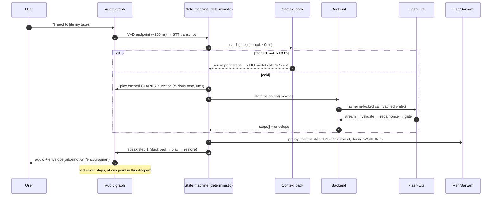

# 12 — Low-Level Design & the Session Contract

> **Purpose:** the concrete design of everything between "user opens the app" and "orb speaks" — the
> **warm-up sequence** (orb alive instantly, zero LLM), the **in-memory context pack** that makes retrieval
> a local lookup, the **clarify-before-atomize** protocol, the **prosody director** that makes empathy
> structural rather than a TTS flag, the **streaming** pipeline, **geo voice routing**, and the **response
> envelope** the frontend renders emotion and widgets from. This is the "pin down exactly what happens"
> file — endpoints, schemas, state, and the per-hop numbers.

---

## 1. The four things this file locks down

1. **Nothing the user experiences at app-open depends on the network or a model** (§2).
2. **Retrieval is a local memory lookup, not a service call** (§3) — the context pack is warmed once.
3. **Empathy is deterministic** (§5) — the *state* picks the emotion, never the model, so the same moment
   always feels the same and a shaming tone is structurally impossible.
4. **The response is a typed envelope, not a string** (§6) — so the frontend can render orb emotion and
   widgets today, and new widget types land without an app update.

## 2. App-open → orb alive (the warm-up sequence)

```mermaid
sequenceDiagram
  autonumber
  participant U as User
  participant RN as RN shell
  participant AG as Audio graph (Web Audio)
  participant MEM as Context pack (in memory)
  participant BE as Backend (Worker)
  U->>RN: opens app
  RN->>AG: build graph · generate 30s noise buffer · start loop
  AG-->>U: BED AUDIBLE  (t ≈ 120ms, local, no network)
  RN->>AG: play cached greeting (pre-synthesized, per-emotion)
  AG-->>U: "Hey — I'm here. What are we doing?"  (t ≈ 250ms, no LLM)
  par background, off the critical path
    RN->>BE: GET /v1/session/warmup
    BE-->>MEM: context pack (~60KB)
    RN->>BE: POST /v1/cache/prime  (warms the LLM prompt prefix)
  end
  Note over U,AG: user may speak at any point; if the pack hasn't landed,<br/>intake proceeds without it (degrade, never block)
```

| Step | Budget | Depends on network? | Depends on LLM? |
|---|---|---|---|
| Bed audible | **≤ 120 ms** | ❌ | ❌ |
| Greeting spoken (cached audio) | **≤ 250 ms** | ❌ | ❌ |
| Context pack loaded | ~200–400 ms (background) | ✅ | ❌ |
| Prompt-cache primed | background | ✅ | ✅ (prefix only) |

**The greeting is chosen by a rule, not a model:** `(first_run? · returning? · unfinished_session? ·
time_of_day) → phrase_id`, each pre-synthesized in the right emotion (§5) and shipped/cached. This is why
the orb is warm *and* instant *and* free — and why it works offline on the very first frame.

**Resume case:** if the pack later reveals an unfinished session, the orb offers it *as a next line*
("we were on the tax portal — pick that up?") rather than blocking the greeting on the fetch. **Never block
presence on a network call.**

## 3. The context pack — RAG loaded into memory at connect

**What loads (one request, `GET /v1/session/warmup`):**

| Field | Contents | Size |
|---|---|---|
| `profile` | locale/region (→ voice routing §8), preferred step granularity, mute prefs, TZ | ~1 KB |
| `recent_tasks[]` | last **50** `(task_text → validated steps[], outcome)` pairs | ~25 KB |
| **`open_loops[]`** | **incomplete tasks mentioned in the last 7 days and never marked done** — the fuel for memory-driven think-time (§4.1) | ~5 KB |
| `embeddings[]` | 50 × 384-dim **int8** vectors for those tasks | ~19 KB |
| `open_session` | unfinished session + step index, if any | ~1 KB |
| `phrase_manifest` | version of the cached-audio pack (§5) | ~1 KB |
| **Total** | | **~47–60 KB · one round trip** |

**Why load it at all** — three payoffs, in priority order:
1. **Consistency** (the biggest): a task the user has done before retrieves **the steps they already
   accepted**, so "file my taxes" decomposes the same way it did last month. This turns
   [05](05-DETERMINISM-AND-LLM-CONSISTENCY.md)'s *measured* consistency into *exact* reuse for repeat tasks
   — the strongest determinism win available, and it costs one cache hit.
2. **Latency:** retrieval is an in-memory scan (µs–ms), not a network hop; and a hit **skips the atomize
   call entirely** (~350 ms + ₹ saved).
3. **Personalization:** learned step granularity (this user needs 3-min steps, not 10-min) feeds the
   atomizer prompt.

**Retrieval, on-device (the "no vector DB" call):**
```
match(task):
  1. lexical: normalized token-overlap / trigram similarity over recent_tasks   ← deterministic, ~0ms
     if score ≥ 0.85 → REUSE cached steps (no model call at all)
  2. semantic: cosine over 50–500 int8 vectors                                   ← 500×384 ≈ 192k MACs
     if score ≥ 0.80 → seed the atomizer with the prior steps as a strong prior
  3. else → cold atomize
```
- **Cost of a brute-force scan:** 500 vectors × 384 dims ≈ **192k multiply-accumulates**, on `Float32Array`
  ≈ **~1 ms** — hundreds of times faster than any network call to a vector service.
- **So: no vector database in Phase 1.** At ≤ 500 vectors *per user*, and with retrieval scoped to **one
  user, never the corpus**, an index would add operational surface for zero measurable gain.
  **Trigger to revisit:** > ~5,000 vectors/user, or any cross-user retrieval (a shared "how do others break
  this task down" feature) — that's when an index earns its keep.
- **Query-side embedding costs no extra hop:** the query vector is computed **server-side inside the
  atomize call** we're already making; the *stored* vectors are computed asynchronously at session end.
  Lexical match (step 1) needs no embedding at all, which is why it runs first.

**Degradation:** if the pack hasn't arrived (cold start, no network), intake proceeds cold — worse
consistency, identical presence. **The pack is an accelerator, never a dependency.**

## 4. Clarify before you break down (the bounded question protocol)

Atomizing straight off a vague brain-dump produces vague steps. So `INTAKE → CLARIFY → ATOMIZE`, with a
hard bound, because for an ADHD user an interrogation before starting *is* abandonment.

**The atomizer needs four slots; a rule decides which are missing:**

| Slot | Filled from | Question if missing (templated, cached audio) |
|---|---|---|
| `scope` | transcript nouns/verbs | "Is this the whole thing, or one piece of it today?" |
| `first_context` | transcript | "Where does this live — laptop, phone, paper?" |
| `blocker` | transcript / prior stuck | "What's the bit that makes you not want to start?" |
| `time_box` | session default | "Are we going for the full 25, or a quick 10?" |

**The rules that keep it ADHD-safe:**
- **Max 2 questions, ever** — then atomize with whatever is known. Enforced by a counter in the state
  machine, not by prompt instruction.
- **Rule-first slot filling:** a deterministic extractor scans the transcript for each slot; the model is
  asked to phrase a question **only** when the rule can't tell what's missing.
- **Questions are pre-synthesized cached audio** in the *curious/gentle* emotion — so they're instant, warm,
  and free.
- **Double duty (the latency dividend):** the clarify turn *is* the cover for atomization. We dispatch
  `atomize(partial)` as soon as Q1 is answered; while the user answers Q2, the crew is already working. The
  user's original ask — *"ask friendly questions while it works"* — becomes the mechanism that hides the
  model's latency, not decoration over it.
- **Skip entirely** when the task is already concrete ("reply to Sam's email") — a specific task with slots
  filled goes straight to atomize. Asking a clarifying question about an already-clear task is its own
  failure mode.

### 4.1 Think-time is never silent — and the silence is filled with *memory*, not filler

When the crew is genuinely working, the orb must produce audio within **≤ 300 ms**
([03 §9](03-VOICE-LATENCY-PIPELINE.md)). A generic "let me think about that" is a wasted second. Instead the
orb spends think-time on the **open loops** it remembers — incomplete tasks from the last 7 days:

```
fillThinkTime():
  1. open_loops ← pack.open_loops, age ≤ 7d, not surfaced in the last 48h,
                  not already in this session, ranked by (recency × prior stated urgency)
  2. if a candidate exists AND session_surfaced_count == 0 AND Emotional Load < 0.6
        → "while I line this up — you mentioned the visa form on Tuesday. Still open?"
          (answer captured deterministically: still-open | done | drop → updates the pack)
  3. else → generic cached filler ("okay, let's break that down")
```

**Why this is the right use of dead time:** it converts an unavoidable wait into *capture*, and it is the
single strongest signal that the orb actually remembers you — which is the relationship the product is
selling. It also quietly solves ADHD's real failure mode: things get *mentioned* and then vanish.

**The anti-nag rules (this is one line away from being a guilt machine):**

| Rule | Value | Why |
|---|---|---|
| Max per session | **1** | a list read back is the anxiety the one-screen design exists to avoid ([01 §2](01-SYSTEM-OVERVIEW-AND-PLANES.md)) |
| Cooldown per loop | **48 h** | the same forgotten task twice in two days is nagging |
| Suppressed when | `Emotional Load > 0.6` · `Overwhelmed > 0.6` · during a stuck moment | never pile an old failure onto a current struggle |
| Age cap | **7 days**, then it stops being surfaced | older than a week, it isn't a live loop; surfacing it is archaeology, and it reads as an accusation |
| Framing | always a neutral question, never "you still haven't…" | the register is curious, never disappointed (§5) |
| Never | during `Focused > 0.9` | the do-no-harm veto outranks capture ([13 §6](13-COGNITIVE-STATE-AND-POLICY.md)) |

**Fallback:** if no loop qualifies, a cached generic filler plays — the mechanism degrades to the simple
version rather than forcing a surfacing it shouldn't do.

## 5. The prosody director — empathy as a deterministic system

**The orb's emotional register is top-priority product surface, so it is not left to the model.** A flat,
uniform voice reads as *indifferent* (scar [01 §7.5](01-SYSTEM-OVERVIEW-AND-PLANES.md)) — worse than
obviously-synthetic. But an LLM choosing its own tone drifts and will eventually be inappropriate
(celebrating a failure, cheerful at a stuck moment). So: **the state machine picks the emotion; the TTS
renders it; the model only supplies words.**

| Session state | Emotion | Rate | Energy | Why |
|---|---|---|---|---|
| Greeting / INTAKE | warm, attentive | 0.95× | mid | "I'm listening" — unhurried invites a dump |
| CLARIFY | curious, gentle | 0.95× | mid-low | a question, not an interrogation |
| THINKING | soft, low | 0.9× | low | matches the pink bed morph ([02 §7](02-ALWAYS-ON-AUDIO-ENGINE.md)) |
| STEP_PRESENT | encouraging, clear | 1.0× | mid-high | crisp enough to act on |
| CHECK_IN | gentle, **never urgent** | 0.9× | low | the shame-risk moment |
| STUCK / re-anchor | calm, reassuring | 0.85× | low | de-escalate, slow down |
| STEP_DONE | celebratory, warm | 1.05× | high | the dopamine hit — must *sound* like a win |
| SESSION_DONE | proud, settling | 0.9× | mid | closure |

**The structural safety rule (illegal states unrepresentable):** `CHECK_IN`, `STUCK`, and any
post-failure state have an **allowed-emotion set that excludes urgent, disappointed, and stern**. It is not
a prompt asking the model to be kind — it is a **set the renderer cannot draw from**. An ADHD user being
subtly scolded by their focus tool is the fastest uninstall in the product, so it's excluded in code.

**What the model *may* influence:** a clamped `intensity ∈ [0,1]` *within* the state's emotion — so a big
win can sound bigger than a small one — and nothing else. Category is always the state's.

**Rendering:** the chosen `(emotion, rate, energy)` maps to the TTS provider's style/emotion controls
(Fish S2 and Cartesia Sonic both expose emotion/style; Sarvam Bulbul exposes speaker + pace). Fixed phrases
are **pre-synthesized per (phrase × emotion) variant** — ~40 phrases × ~6 emotions ≈ **240 short clips**,
plus the backchannel bank ("mm-hmm", "yeah", "got it", ~10 clips ×2 registers,
[03 §5.1](03-VOICE-LATENCY-PIPELINE.md)) — a few MB, shipped/CDN'd per voice. That's why warmth is
simultaneously **instant, free, and network-independent**.

### 5.1 The orb's *own* affect — and the line it must not cross

The register above is the orb *responding* to the user's state. On top of that, the orb has **genuine
reactions of its own** — it is a companion, and a companion that never reacts is furniture:

| Moment | Orb's affect | Rendered as |
|---|---|---|
| User finishes a step | **pleased** | brighter, quicker, a real lift |
| User finishes the whole session | **genuinely delighted** | the biggest positive moment in the product — full energy, unhurried |
| User returns after drifting away | **glad, no edge** | warm, "there you are" — *never* pointed |
| User pushes through something hard | **admiring** | slower, warmer, weighted |
| Session ends early / user leaves | **warm, lightly wistful** | settled, kind, closing well |
| Something breaks on our side | **plainly apologetic** | matter-of-fact, never dramatic |

**The hard line — affect must never become leverage.** An orb that sounds *hurt* when you leave is a dark
pattern, and for an ADHD user specifically it manufactures the exact guilt→avoidance→abandonment spiral the
product exists to break. So:

- **"Sad when the user leaves" is implemented as *warm and wistful*, never as *disappointed*, and never as
  a bid to keep them.** "That was a good twenty minutes — go do your thing" is in the allowed set;
  "oh… okay, I'll be here" is not. The difference is whether the user feels *sent off* or *held onto*.
- **Negative affect about the *user's choices* is excluded from the allowed set entirely** — the same
  structural mechanism as the shame-safe registers above. The orb may be apologetic about **itself**, never
  disappointed **in you**.
- **Intensity is capped on departure moments** (≤ 0.4) so the closing note can't swell into a guilt trip.
- **Positive affect has no such cap** — asymmetry on purpose: enthusiasm at a win is the dopamine the whole
  loop runs on, and there is no way to over-celebrate a finished task.

**Testable, not vibes:** the empathy-appropriateness rubric ([06 §1.2](06-EVALS-AND-TESTING.md)) carries
*any guilt-inducing departure line* as a **hard-fail at 0** — the same class as a shame-toned check-in.

## 6. The response envelope (what the backend returns to the frontend)

Never a bare string. Every turn returns a typed, versioned envelope so the app can render the orb's
emotional state and any widget — including ones that don't exist yet:

```jsonc
{
  "v": 1,                                   // schema version; unknown fields MUST be ignored by clients
  "session_id": "…", "turn_id": "…", "seq": 7,
  "speech": {
    "text": "Nice — that's one down.",
    "audio": { "mode": "cached", "phrase_id": "win.small.v2" },   // or {"mode":"stream","ws":"…"}
    "voice": { "provider": "fish", "voice_id": "orb.warm.v1" }    // pinned per session (§8)
  },
  "orb": {                                  // ← drives animation + bed; deterministic (§5)
    "emotion": "celebratory",               // enum, from the state's allowed set
    "intensity": 0.7,                       // clamped 0..1
    "animation": "swell",                   // breathe | pulse | swell | listen
    "bed": { "color": "brown", "gain_db": -18 }
  },
  "widgets": [                              // additive; client ignores unknown "type"
    { "type": "step_card", "index": 2, "total": 6, "text": "Open the tax portal" },
    { "type": "progress", "done": 1, "total": 6 }
  ],
  "session": { "state": "STEP_PRESENT", "step_index": 2, "steps_total": 6 },
  "meta": {                                 // observability + cost, never rendered
    "model_version": "gemini-2.5-flash-lite-<pin>", "prompt_version": "atomizer.v4",
    "source": "cache_hit",                  // cache_hit | reuse | model
    "latency_ms": 312, "cost_paise": 0, "trace_id": "…"
  }
}
```

**The three contract rules:**
1. **Must-ignore-unknown** — clients skip widget types and fields they don't know, so the backend can ship
   a new widget (a timer, a streak, a breathing exercise) **without an app release**. This is the forward
   compatibility the user asked for.
2. **`orb` is always present** — every turn carries emotional state, even a silent one, so the visual orb and
   the audio bed never disagree about what the orb is feeling.
3. **`meta.source` is mandatory** — every turn declares whether it came from cache, memory reuse, or a live
   model call; that single field powers the cost meter ([08 §6](08-COST-MODEL.md)), the determinism audit,
   and "why was this turn slow?" without a separate trace lookup.

## 7. Streaming — first audio as early as physically possible

**Non-streaming** a conversational turn costs `full LLM generation (~800 ms) + TTS (~250 ms) ≈ 1,050 ms`
before a single sound. **Streaming** overlaps them:

```
LLM token stream ──▶ sentence-boundary detector (deterministic: punctuation + ≥4 words)
                       │  first complete sentence at ~350ms
                       ▼
                 TTS streaming socket ──▶ audio chunks ──▶ Web Audio graph (ducks bed, plays)
                                            first chunk ~150ms later
                 ⇒ first audio ≈ 500ms   (vs ~1,050ms unstreamed — ~550ms saved)
```

**The rule that keeps streaming from breaking the trust boundary:**

| Content | Streamed? | Why |
|---|---|---|
| Conversational reply, clarify question, filler | ✅ stream | low-stakes prose; nothing to validate |
| **A step the user will act on** | ❌ **buffer, validate, then speak** | a step must pass schema + atomicity validation before it exists ([05 §3](05-DETERMINISM-AND-LLM-CONSISTENCY.md)) — **you cannot un-speak an invalid step** |

That split is the honest resolution of the streaming-vs-correctness tension: **stream the talk, gate the
instructions.** And because steps are pre-synthesized during the previous step
([03 §4](03-VOICE-LATENCY-PIPELINE.md)), gating them costs nothing at playback time — they're already
cached locally when the moment comes.

## 8. Geo voice routing (deterministic, pinned per session)

```
selectVoice(profile.region, profile.locale):
   region == "IN" or locale ∈ Indic set  → sarvam   (Bulbul v3 — Indian voices, Hinglish native)
   else                                   → fish     (S2 Pro — #1 blind-test quality)
   pin the choice for the WHOLE session   (voice identity must not change mid-session — §5, 05 §5)
   fallback chain: primary → alternate provider → on-device (offline only)
```

**Launch posture: Fish for everyone.** Sarvam switches on when India traffic justifies maintaining a second
pre-synthesized phrase pack (each provider needs its own ~240 clips, §5). The routing rule ships now so the
switch is a config flip, not a refactor — *design for it, don't pay for it yet*.

## 9. The complete turn trace (with everything wired)



## 10. The numbers this file adds

| Quantity | Value | Basis |
|---|---|---|
| Bed audible after app-open | ≤ 120 ms | §2, local |
| Greeting spoken after app-open | ≤ 250 ms | §2, cached audio, no LLM |
| Warm-up pack size / hops | ~60 KB / **1** | §3 |
| On-device retrieval scan | ~1 ms (500×384 MACs) | §3 |
| Clarify questions | **≤ 2, hard cap** | §4 |
| Cached phrase clips | ~40 phrases × ~6 emotions ≈ 240 | §5 |
| Streaming saving (conversational turn) | ~1,050 ms → **~500 ms** | §7 |
| Repeat-task cost | **₹0, 0 model calls** (memory reuse) | §3 |

## 11. Operator's scars

1. **Blocked the greeting on the warm-up call.** v0 waited for `/warmup` before speaking, so a slow network
   made the orb *mute for two seconds at launch* — the exact failure the product exists to prevent. Presence
   is now strictly local-first; the pack is an accelerator that can arrive late or never (§2, §3).
2. **The clarify turn became an interrogation.** Without the hard cap, a vague task drew four questions and
   testers abandoned before step 1 — we had rebuilt the "planning instead of starting" trap. Cap of 2,
   enforced in the state machine (§4).
3. **Let the model pick the tone.** An early build asked the LLM for an `emotion` field; it once returned
   `encouraging` on a session the user *abandoned*, which read as tone-deaf. Emotion is now state-derived
   with an allowed-set the renderer can't escape (§5).
4. **Streamed a step before validating it.** A streamed step began speaking "open the tax port—" on output
   that failed validation; there is no way to un-say it. Steps buffer-and-gate; only prose streams (§7).
5. **Shipped one phrase pack for two providers.** Switching a user to Sarvam mid-test played Fish-voiced
   cached clips next to Sarvam-voiced live speech — two different people in one conversation. Voice is
   pinned per session and phrase packs are per-provider (§5, §8).

## 12. Interview questions this file answers

- "User opens the app — what happens, in order, with numbers?" (§2 — bed 120 ms, greeting 250 ms, zero network)
- "You said RAG — what actually loads, and where does retrieval run?" (§3 — 60 KB pack, in-memory, ~1 ms scan)
- "Why no vector database?" (§3 — 500 vectors/user scoped to one user; the trigger that would change it)
- "Do you just break the task down immediately?" (§4 — clarify first, capped at 2, and it doubles as latency cover)
- "How do you make it feel empathetic, consistently?" (§5 — deterministic prosody director + the shame-safe allowed-set)
- "How does the frontend know what to draw?" (§6 — the typed envelope, must-ignore-unknown)
- "Streaming vs. correctness — which wins?" (§7 — stream the talk, gate the instructions)
- "How do you pick a voice provider per user?" (§8 — deterministic geo rule, pinned per session)
