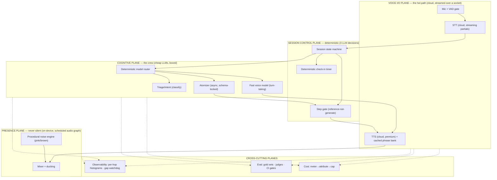

# The Focus Orb — an L8 Deep-Dive on a Voice Body-Double for ADHD (Phase 1)

> **What this folder is.** A plane-by-plane, number-by-number engineering deep-dive of **Phase 1**
> of an always-on voice companion for ADHD: a single on-screen **orb** you talk to that runs a
> **body-doubling focus session** — take one spoken task, break it into ADHD-atomic steps, drip
> them one at a time, and stay *audibly present* the entire time so the user never drifts. Written
> at the depth an L8/principal is expected to hold in their head: not "we play a background sound"
> but *a procedurally-generated, crossfaded noise buffer in a scheduled audio graph with a 0 ms gap budget
> and an interruption-recovery matrix*; not "we call an LLM" but *which model at what Aug-2026 price, driven
> by a deterministic router, boxed so it behaves the same on every run*; not "it sounds friendly" but *a
> state-driven prosody director whose shame-adjacent registers are structurally unrepresentable, graded by a
> voice-to-voice eval*.
>
> **Who it's for.** The builder (you) — to read, internalize, and build by hand, in **React Native**
> (no custom native module), keeping everything free and local *except* the two things that must be
> excellent: hearing you and speaking to you.
> Every file ends with the **operator's scars** and the **L8 interview questions it arms you to
> answer** ([11-L8-INTERVIEW-DRILL.md](11-L8-INTERVIEW-DRILL.md) consolidates the bank).
>
> **The depth bar** (inherited from [`../AUTHORING-GUIDE.md`](../AUTHORING-GUIDE.md) §5, R17–R21):
> every mechanism gets an implementation, every guarantee a number with its math, every number a
> dated source, every component its failure story. "We keep it responsive" is banned; "the voice
> round-trip is p50 ≤ 600 ms / p99 ≤ 1.2 s decomposed hop-by-hop in [03](03-VOICE-LATENCY-PIPELINE.md),
> and here is what a 4G RTT spike does to it and how the deterministic filler hides it" is the bar.

---

## 1. The system in one paragraph

An **orb** (one animated blob, one screen, no lists) that a user with ADHD talks to, that runs a
**focus session**: the user says one thing they want to do; a **deterministic session state machine**
drives the session while a **cheap LLM crew** does the language work — an **atomizer** turns the task
into the smallest first step, a **conversational voice** keeps momentum, and a **belief-driven policy**
decides when to speak and when to stay out of the way ([13](13-COGNITIVE-STATE-AND-POLICY.md)). Underneath everything, from the first second to the last, a **never-silent noise bed**
(pink/brown, generated on-device) holds the user's attention so a moment of think-time silence never
crashes their dopamine and uninstalls the app. The LLM is the only probabilistic component and is
**boxed on every exit** (schema-validated output, pinned versions, deterministic control path). The
hard bet of Phase 1: **presence + one atomic step + never-silence** beats every feature we deliberately
deferred (proactive pings, scheduling, the todo pile, analytics, adaptive learning — §9). Targets:
**20,000 users · ~6,000 DAU · ~500 peak concurrent sessions — no rewrite to 200K; ≤ ₹120/active-user/month — voice quality is never compromised, so voice is ~85–90 % of
cost, kept in bounds by phrase caching, socket discipline, and a self-host path; conversational voice
round-trip p50 ≤ 600 ms; audio-bed gap budget 0 ms; the session control path takes 0 LLM decisions.**

## 2. The one-screen product, and the presence-local / speech-cloud split (read this before anything else)

The product surface is **one orb, zero lists** — a deliberate ADHD choice: a visible backlog of 30
todos is an anxiety generator, so the todos live in voice and the screen shows only presence and the
*current* atomic step ([01](01-SYSTEM-OVERVIEW-AND-PLANES.md) §2). The architecture decision that makes
this work is **presence runs locally and never stops; speech runs in the cloud and is never compromised**:

| Concern | **What runs where** | Why |
|---|---|---|
| Noise bed | **On-device, procedural, in a scheduled RN Web Audio graph** | ₹0, gapless, network-independent — invariant #1 ([02](02-ALWAYS-ON-AUDIO-ENGINE.md)) |
| Session state machine · belief model · policy | **On-device / relay arithmetic** | 0 LLM decisions, ~0 ms, ₹0 ([05](05-DETERMINISM-AND-LLM-CONSISTENCY.md), [13](13-COGNITIVE-STATE-AND-POLICY.md)) |
| Cached phrases · backchannels · pre-synth'd steps | **On-device audio cache** (premium voice, synthesized once) | premium quality at **0 ms and ₹0**, and it still plays with no network |
| **Speech-to-text** | **Cloud only — Sarvam Saarika (Indic/Hinglish) · Deepgram Nova-3 (global)**, streamed | **on-device STT is rejected outright**: unusable on accented and code-mixed speech ([03 §2](03-VOICE-LATENCY-PIPELINE.md)) |
| **Text-to-speech — the orb's voice IS the product's face** | **Cloud only — Fish Audio S2 (default) · Sarvam Bulbul (India) · Cartesia** | **on-device TTS is rejected outright**: flat delivery reads as indifference; self-host at volume ([08 §3](08-COST-MODEL.md)) |
| The "brain" | **Gemini 2.5 Flash-Lite / Claude Haiku** (cheap, bursty) | the *minor* line — **~7 %** of cost ([08 §1](08-COST-MODEL.md)) |
| Audio transport | **Device → our relay (WebSocket) → providers** | keys off-device, provider swap without a release, in-path cost caps ([03 §3](03-VOICE-LATENCY-PIPELINE.md)) |

**The split is not "on-device by default" — it is *presence local, speech cloud*.** Everything that must
never stop (the bed, the state machine, cached audio) is local and free. Everything that must be *good*
(hearing you, speaking to you) is cloud, because the on-device versions are genuinely bad at accented and
multilingual speech, and a degraded voice is a broken product, not a graceful fallback. **The honest price
of that call:** with no network the orb is **deaf and mute** — still present, but it says so plainly rather
than mangling your language ([09 §3](09-FAILURE-DR-AND-DEGRADATION.md)).

**The L8 point:** the naive way to get an empathetic voice — pipe the mic into a cloud **speech-to-speech**
model (OpenAI Realtime) for 25 minutes — costs **₹47–260 per session** ([08](08-COST-MODEL.md) §3,
sourced). You **don't need speech-to-speech for warmth**: a top **neural-TTS pipeline** (Fish S2 Pro ranked
#1 in blind tests; Cartesia/Sarvam near it) delivers a genuinely warm, modulated voice at
**~₹0.7/session of live TTS** (fixed phrases cached; self-host drops it further) — a **15–85× saving** that
is the reason this reaches 20K+ users on a solo-dev budget *without* a robotic voice. And the pieces that
**must never stop** — the bed, the cached step audio, the state machine and policy — stay local, so they
need no packet and cost nothing per user. **The app is pure React Native — we write no custom native module.** The gap-critical audio runs on
`react-native-audio-api` (Web Audio for RN, backed by a library-owned C++ audio thread): we declare a
**scheduled** graph from JS, so **JS is never in the audio render loop** and a GC pause cannot gap the bed
([02 §3](02-ALWAYS-ON-AUDIO-ENGINE.md)). That keeps the guarantee *structural* while keeping RN's reach and
a solo dev's velocity — with the library dependency named as a risk and a 4-step fallback ladder, not
hand-waved.

## 3. The planes (the mental model that organizes every file)

Five planes. Every file names which plane owns its decisions. The ordering that matters: **the Presence
plane outranks all others on failure** — under any degradation the noise bed is the *last* thing to
stop ([09](09-FAILURE-DR-AND-DEGRADATION.md) §2), because to an ADHD user silence *is* the outage.

## 4. The hard targets (the spec every artifact must honor)

1. **Scale:** 20,000 users · ~6,000 DAU · ~6,000 sessions/day · **~500 peak concurrent sessions**
   ([07](07-CAPACITY-AND-LATENCY-MATH.md) §1) — served on a **thin stateless backend + on-device compute**,
   with **no architectural rewrite to 200K** (a tier swap + one server, §7).
2. **The audio invariant (#1):** **0 ms unasked-for silence while the app is foreground and a session is
   live.** Measured: **0 gap events**; bed audible **≤ 120 ms** after app-open, orb greets **≤ 250 ms**
   (local, no network, no LLM — [12 §2](12-LLD-AND-SESSION-CONTRACT.md)); transient interruptions (call /
   Siri) recover **≤ 300 ms** behind a cover. Enforced by a continuous-audio watchdog **and** a
   recorded-output loudness-floor probe.
   **Its necessary twin — the pause contract:** backgrounding, screen-lock, or a Bluetooth/headphone
   disconnect **pauses everything and releases the mic at the OS level**, with a visible "not listening"
   state. Silence the user *asked for* is mandatory, and faking presence there would be a trust violation —
   so the warmth lever (background audio keeping the process alive) is **deliberately given up**
   ([02 §5.1, §8](02-ALWAYS-ON-AUDIO-ENGINE.md)).
3. **Voice latency SLO:** user-stops-speaking → orb-first-audio **deterministic turn p50 ≤ 250 ms ·
   conversational p50 ≤ 600 ms, p99 ≤ 1.2 s** ([03 §4](03-VOICE-LATENCY-PIPELINE.md)) — achieved by
   **semantic endpointing** (−300–500 ms vs a silence timer) and **speculative generation**, benchmarked
   against speech-to-speech's ~320–800 ms. **Zero think-time silence:** audio (a cached backchannel, a
   memory-driven prompt, or a filler) within **≤ 300 ms**, always.
4. **Cost:** fully-loaded **≤ ₹120/active-user/month** at 20K (lands **~₹75–96**, [08 §4](08-COST-MODEL.md));
   marginal **~₹2.5–3.2/session**, of which **voice is ~85–90 %** and the LLM only ~7 %.
   **R5 — the ceiling has moved twice, ₹15 → ₹40 → ₹120**, each time because a voice-quality compromise was
   refused (premium TTS, then rejecting on-device STT/TTS outright). Stated, not buried. **The free tier is
   session-capped (5/mo)** because an unlimited one is upside-down at this cost.
5. **Determinism — *probabilistic perception, deterministic cognition and action*:** the session lifecycle
   is a deterministic state machine and the intervention policy is a **pure function over the belief
   vector** — **0 LLM calls decide a state transition, an intervention, or an authority**
   ([05 §1](05-DETERMINISM-AND-LLM-CONSISTENCY.md), [13 §6](13-COGNITIVE-STATE-AND-POLICY.md)). Beliefs are
   estimates, but their update is pure arithmetic, so the same evidence stream replays **bit-identically**.
   Stochastic classifiers may only emit **bounded evidence**, never set a belief or choose an action. Every
   LLM output is **schema-validated before use**; the same task yields the same atomization within a
   **measured** variance bound ([05 §4](05-DETERMINISM-AND-LLM-CONSISTENCY.md)), not "usually."
6. **No rewrite:** every scale step is an **interface swap or a new instance**, never a rebuild — the
   on-device/cloud boundary is fixed on day one so 20K→200K adds infrastructure without moving a boundary.

If a file touches latency, cost, scale, or determinism, it **must** reconcile to these targets and cite
where the full proof lives (R6/R7).

## 5. File map + reading order

| # | File | Plane | What it proves you know |
|---|---|---|---|
| 01 | [SYSTEM-OVERVIEW-AND-PLANES](01-SYSTEM-OVERVIEW-AND-PLANES.md) | all | the session lifecycle, RN-shell-vs-native-module split, the sync/async boundary, the hop budget |
| 02 | [ALWAYS-ON-AUDIO-ENGINE](02-ALWAYS-ON-AUDIO-ENGINE.md) | presence | procedural gapless noise in a **scheduled RN Web Audio graph** (no native module), the crossfaded-buffer seam fix, interruption recovery matrix, dependency-risk ladder, battery/CPU math |
| 03 | [VOICE-LATENCY-PIPELINE](03-VOICE-LATENCY-PIPELINE.md) | voice | the end-to-end budget table, VAD/endpointing, barge-in, streaming TTS, the deterministic filler, measuring without lying |
| 04 | [MODEL-ROUTER-AND-THE-CREW](04-MODEL-ROUTER-AND-THE-CREW.md) | cognitive | the two-tier fast/crew split, the **deterministic** router, model portfolio + prices, the realtime-API rejection math |
| 05 | [DETERMINISM-AND-LLM-CONSISTENCY](05-DETERMINISM-AND-LLM-CONSISTENCY.md) | control/cognitive | the deterministic shell, schema-locked output, version/seed pinning, same-input→same-behavior *measured* |
| 06 | [EVALS-AND-TESTING](06-EVALS-AND-TESTING.md) | eval | gold sets with sizes, the "is-this-atomic" metric, the consistency harness, rule-of-three/pass^k, CI gates |
| 07 | [CAPACITY-AND-LATENCY-MATH](07-CAPACITY-AND-LATENCY-MATH.md) | all | the 20K demand model, session-min vs speech-min vs turns, Little's law, the honest p99 audit, the no-rewrite envelope |
| 08 | [COST-MODEL](08-COST-MODEL.md) | cost | ₹/session + ₹/user/mo on this stack, voice-cost dominance, on-device-vs-cloud crossover, sensitivity |
| 09 | [FAILURE-DR-AND-DEGRADATION](09-FAILURE-DR-AND-DEGRADATION.md) | all | the degrade ladder (bed never degrades), per-plane failure catalog, offline mode, the gap-is-the-outage doctrine |
| 10 | [CROSS-EXAMINATION](10-CROSS-EXAMINATION.md) | all | 30+ break-the-system scenarios answered at mechanism level |
| 11 | [L8-INTERVIEW-DRILL](11-L8-INTERVIEW-DRILL.md) | — | the consolidated question bank |
| **13** | [**COGNITIVE-STATE-AND-POLICY**](13-COGNITIVE-STATE-AND-POLICY.md) | cognitive/control | **how the orb models the user:** **orthogonal registers** (a person is focused *and* tired *and* avoiding — 30 values, not 3,024 states) · multi-label Barrier · the **belief vector** with log-odds updates and **confidence decay** · the **Phase-1 observability audit** (what a phone app can and cannot sense) · **rules vs cosine vs small-LLM** state inference (§5.1) · the **deterministic policy** with do-no-harm veto, refractory, budget, hysteresis, least-power · calibration/replay testing |
| **12** | [**LLD-AND-SESSION-CONTRACT**](12-LLD-AND-SESSION-CONTRACT.md) | all | **the concrete design:** app-open warm-up (bed 120 ms, greeting 250 ms, 0 LLM) · the in-memory RAG context pack + on-device retrieval math (no vector DB, with the trigger) · **clarify-before-atomize** (capped at 2) · the **prosody director** (empathy as a deterministic system) · streaming (stream the talk, gate the instructions) · geo voice routing · **the response envelope** the frontend renders emotion/widgets from |

**Reading order for study:** 01 (the map) → **02** (the invariant everything else protects) → **12** (the
concrete LLD — what actually happens from app-open) → **13** (how the orb models *you*, and decides when to
speak) → **03** (the hot path, where latency is won) → **04**
(driving the LLMs) → **05** (making them behave the same) → 06 (how all of it is tested, **voice-to-voice**)
→ 07 (the numbers) → 08 (the money) → 09 (how it breaks) → 10 (the adversarial pass) → 11 (the drill).

## 6. Canonical facts — the single source of truth (verify & date each time)

> Every document must agree with these. When a fact changes, update it **here first**, then grep the
> folder and fix every dependent number (R7). **Prices verified August 2026; re-verify before reuse.**
> FX is the estate constant ([`../AGENTS.md`](../AGENTS.md)); model prices are re-verified for this
> voice-domain build because the estate's canonical set predates the STT/TTS/realtime lines this
> product depends on.

**FX:** $1 = **₹95** (estate canonical, Aug 2026).

**The "brain" (cheap LLM tier), per M tokens:**
- **Gemini 2.5 Flash-Lite** — **$0.10 in / $0.40 out** (context-cache −90% input; batch −50%). *Note: Google lists retirement 16 Oct 2026 — it is the cheap-tier **archetype** here; its successor/Haiku is the fallback and re-prices §04.*
- **Claude Haiku 4.5** — **$1 in / $5 out** (estate canonical; prompt-cache hit = 10% of input; batch −50%). Used as the quality-escalation and cross-provider fallback.

**Voice I/O — both directions are cloud (the on-device versions are rejected, [03 §2](03-VOICE-LATENCY-PIPELINE.md)):**
- **Text-to-speech, per 1M chars:** **Fish Audio S2 Pro $15** (ranked **#1** in blind tests, open-weights → **self-hostable**) · **Sarvam Bulbul v3 ~$16.5** (₹15–30/10K; 11 Indian langs + Hinglish, ₹-billed) · **Cartesia Sonic ~$35** (**40 ms** TTFA) · **Kokoro ~$0.70 self-hosted** · *anchor we avoid:* **ElevenLabs $120**. With fixed-phrase + backchannel caching only ~**500 novel chars/session** are billed ⇒ **~₹0.7/session**.
- **Speech-to-text (streaming):** **Sarvam Saarika/Saaras ₹30/hr** ($0.000092/s; 22 Indian langs + code-mixing) · **Deepgram Nova-3 $0.0077/min** (global; **word-level partials < 50 ms**). Billed ≈ **3 min/session** (socket opens on speech, closes ~800 ms after endpoint) ⇒ **~₹1.5–2.2/session — the single largest line.**
- **Noise bed, cached phrases, belief model** — **₹0 marginal** (local).
- **Relay** — one small VM (~₹3k/mo) terminating ~500 concurrent WebSockets ⇒ **~₹0.017/session** ([07 §3](07-CAPACITY-AND-LATENCY-MATH.md)).
- **OpenAI Realtime `gpt-realtime-2.1`** (the **rejected** speech-to-speech path) — **$32/M audio-in, $64/M audio-out** ⇒ **₹47–260/session**; **~320 ms** best-case voice-to-voice, ~800 ms typical. Rejected on **prosody control + determinism + 15–85× cost**, not on latency ([03 §1](03-VOICE-LATENCY-PIPELINE.md)).

**Backend/infra (free-tier-first):** Cloudflare Workers (free: 100k req/day) or one small VM; Supabase
Postgres free tier (durable session/todo mirror); object storage for cold audio/telemetry samples. At
20K, infra is **≈ ₹0–0.05/session** ([08](08-COST-MODEL.md) §5).

**Headline unit economics (derived, [08](08-COST-MODEL.md)):** a ~25-min session — ~3 billed speech-min of
cloud STT, ~500 novel TTS chars (the rest cached), ~5 real LLM calls → **~₹2.5–3.2/session marginal**
(**voice ~85–90 %**: STT ~55 %, TTS ~25 %; **LLM only ~7 %**; relay ~₹0.02), **~₹75–96/active-user/month**
at 30 sessions — under the **₹120** ceiling, bending toward ~₹27 as self-hosting turns on.
**The free tier must be session-capped (5/mo ≈ ₹15)** — at ~₹3/session an unlimited free tier is
upside-down ([08 §1.1](08-COST-MODEL.md)). The same session on **speech-to-speech** would be **₹47–260**.

## 7. Scale constants (the 20K demand model; full derivation in [07](07-CAPACITY-AND-LATENCY-MATH.md))

**Current rung — 20,000 users:**

| Quantity | Derivation | Value |
|---|---|---|
| DAU | 30% of 20k (focus tools skew high-intent, low-retention — §9) | **~6,000** |
| Sessions/day | ~1 focus session / DAU | **~6,000** |
| Session length | one Pomodoro-style block | **25 min** |
| **User speech / session** | start dump + ~5 check-in replies + "done"s (VAD-gated; user is silent while working) | **~2.5 min** (not 25 — the key split) |
| LLM turns / session | atomize(1) + step transitions(~6) + check-ins(~5) + wrap(1) | **~15** |
| Tokens / turn | blended atomizer + check-in | **~600 in / 120 out** |
| Peak session starts | ~20% of daily in the peak hour (morning/after-lunch/evening clusters) | **~1,200/hr = 20/min** |
| **Peak concurrent sessions** | Little's law: L = λ·W = 20/min × 25 min | **~500** |
| Peak LLM turn rate | 500 concurrent × 15 turns ÷ 25 min | **~5 turns/s** (×3 burst ⇒ ~15/s) |

**The honest headline:** at 20K, **nothing is throughput-bound** — 5–15 LLM turns/s is trivial for a
cheap hosted model, and STT/TTS/noise are per-device. The engineering problems are **(a) on-device audio
gaplessness, (b) the tail of the voice round-trip, (c) LLM behavioral consistency** — correctness and
latency, not scale ([07](07-CAPACITY-AND-LATENCY-MATH.md) §4).

**No-rewrite envelope — 200,000 users (×10):** ~5,000 peak concurrent sessions, ~50–150 LLM turns/s,
still no GPU/queue/cluster. The boundary that stays fixed: **on-device does the audio + the mostly-silent
25 minutes; the cloud does ~15 short bursts.** 20K→200K is *swap the LLM free tier for paid + add one
stateless server + a read replica*, not a re-architecture ([07](07-CAPACITY-AND-LATENCY-MATH.md) §5).

## 8. Capabilities — every case Phase 1 is built to handle

The product surface of Phase 1 (each traceable to the file that owns the mechanism; if a case isn't here,
it isn't designed — §9 lists the deferred ones):

**A. The presence layer (always-on)**
- A never-silent pink/brown bed for the whole session; silence used exactly once, as the deliberate "done" — [02](02-ALWAYS-ON-AUDIO-ENGINE.md) §6
- Survives a phone call / Siri / headphone unplug / backgrounding with ≤ 300 ms recovery, no permanent silence — [02](02-ALWAYS-ON-AUDIO-ENGINE.md) §5
- The bed as an ambient status channel (calm vs "I'm thinking" vs "step ready") via noise-color morph, never start/stop — [02](02-ALWAYS-ON-AUDIO-ENGINE.md) §7

**B. The session loop (body-doubling)**
- **Orb alive the instant the app opens** — bed ≤ 120 ms, a warm greeting ≤ 250 ms, chosen by rule from cached audio: **no network, no model** — [12 §2](12-LLD-AND-SESSION-CONTRACT.md)
- **Asks before it breaks down** — up to **2** scoping questions (rule-picked slots, cached warm audio), which double as the cover for atomization latency — [12 §4](12-LLD-AND-SESSION-CONTRACT.md)
- Speak one task → the atomizer returns the single smallest first step, ADHD-sized, one at a time — [04](04-MODEL-ROUTER-AND-THE-CREW.md) §3, [05](05-DETERMINISM-AND-LLM-CONSISTENCY.md) §3
- **A task you've done before reuses the steps you already accepted** — in-memory context pack, ~1 ms local lookup, **0 model calls, ₹0** — [12 §3](12-LLD-AND-SESSION-CONTRACT.md)
- **Knows when to shut up.** A cognitive **belief model** (attention · barriers · energy · working memory) drives a deterministic **intervention policy**: silent while you're genuinely focused, present when you stall, and structurally incapable of nagging (≤ 6 interventions/session, ≥ 90 s apart) — [13](13-COGNITIVE-STATE-AND-POLICY.md)
- Models you as **focused *and* tired *and* avoiding at once** (orthogonal registers, multi-label barriers), so it picks the *right* fix — shrink the step when Overwhelmed, **add stimulus** when Under-stimulated — [13 §2](13-COGNITIVE-STATE-AND-POLICY.md)
- Non-judgmental re-anchor when you drift; a dysregulated moment can only ever draw a Pause, never a push — [13 §3](13-COGNITIVE-STATE-AND-POLICY.md)
- Completion of a step = an explicit, audible win (dopamine) before the next step is revealed — [01](01-SYSTEM-OVERVIEW-AND-PLANES.md) §3
- Barge-in: the user can talk over the orb at any time; the bed ducks, the orb yields — [03](03-VOICE-LATENCY-PIPELINE.md) §3
- Think-time is never silent: a deterministic filler covers any crew latency > 300 ms — [03](03-VOICE-LATENCY-PIPELINE.md) §5
- A **warm, modulated premium neural voice** as the emotional front — never a robotic on-device TTS; **one** consistent companion identity across sessions (pinned voice = a determinism concern too) — [03 §4](03-VOICE-LATENCY-PIPELINE.md), [05 §5](05-DETERMINISM-AND-LLM-CONSISTENCY.md)
- **Empathy that changes with the moment** — a deterministic prosody director maps each state to an (emotion, rate, energy) register: celebratory on a win, gentle on a check-in, calm when stuck; a **flat voice reads as indifferent**, so uniformity is treated as a bug and gated in the voice-to-voice eval — [12 §5](12-LLD-AND-SESSION-CONTRACT.md), [06 §1.2](06-EVALS-AND-TESTING.md)
- **Structurally shame-proof:** check-in and stuck states draw from an allowed-emotion set that **excludes** urgent/disappointed/stern — the tone that triggers an ADHD shame spiral is unrepresentable, not merely discouraged — [12 §5](12-LLD-AND-SESSION-CONTRACT.md)
- **Streamed replies** (first audio ~500 ms instead of ~1,050 ms), while any step the user will act on is **buffered and validated before it's spoken** — [03 §4.1](03-VOICE-LATENCY-PIPELINE.md), [12 §7](12-LLD-AND-SESSION-CONTRACT.md)
- **A typed response envelope** carrying orb emotion, animation, bed color, and widgets — so the frontend can show emotional state now and new widget types land **without an app release** — [12 §6](12-LLD-AND-SESSION-CONTRACT.md)

**C. The cognitive layer (cheap, consistent LLMs)**
- Fast conversational turn-taking on a cheap model; heavy atomization async on the crew — [04](04-MODEL-ROUTER-AND-THE-CREW.md) §2
- The router **decides deterministically** (rules over classifier output), never an LLM choosing the route — [04](04-MODEL-ROUTER-AND-THE-CREW.md) §2, [05](05-DETERMINISM-AND-LLM-CONSISTENCY.md) §1
- Every step/atomization is schema-validated and repaired-once before it can be spoken or gated — [05](05-DETERMINISM-AND-LLM-CONSISTENCY.md) §3
- Same task → same steps within a measured variance bound; pinned model versions so a silent upgrade can't move behavior — [05](05-DETERMINISM-AND-LLM-CONSISTENCY.md) §4–§5

**D. Reliability & cost**
- Full session works **offline** except the ~15 short brain bursts, which degrade to a cached/deterministic step set — [09](09-FAILURE-DR-AND-DEGRADATION.md) §3
- A degrade ladder that sheds LLM quality and cloud voice **before** it ever touches the bed — [09](09-FAILURE-DR-AND-DEGRADATION.md) §2
- Metered, attributed, capped per-session cost so a runaway loop (or an unclosed audio socket) can't blow the ₹120 ceiling — [08](08-COST-MODEL.md) §6

## 9. Known gaps — what Phase 1 deliberately does NOT do (R5: honestly)

§8 is verified by grepping this folder, not asserted. These are real, deferred-on-purpose absences (the
user agreed Phase 1 = the session loop; everything below is Phase 2+):

1. **Proactive pings / notifications.** Phase 1 is **foreground, session-scoped** — the orb never
   re-engages you when the app is closed. "It pings me when I drift" needs push/local notifications and
   the always-on-background problem, deferred by decision. Honest consequence: "always-on" in Phase 1
   means *always-present while the session is open*, not *always-watching*.
2. **The todo pile + prioritizer.** Phase 1 doubles **one spoken task**; it does not capture a large
   backlog, categorize (health/office/coding…), or rank "not-a-priority-right-now." Capture + triage is
   Phase 2 — bolted onto a proven session loop, not before it.
3. **Scheduling, calendars, time-of-day awareness.** No schedule model, no "ping me at 3pm." Deferred.
4. **~~A fixed check-in timer~~ → now belief-driven; what remains deferred is *learning*.** The cadence is
   no longer a clock: an **intervention policy over a cognitive belief model**
   ([13](13-COGNITIVE-STATE-AND-POLICY.md)) decides when to speak, with a do-no-harm veto that keeps the orb
   silent through real focus. What is still deferred is **learning the weights from data** — Phase 1's
   belief weights are **hand-tuned**, because fitting a model before you have labels produces confident
   nonsense. The trigger to upgrade is explicit: ~100 annotated sessions ([13 §7](13-COGNITIVE-STATE-AND-POLICY.md)).
   Also still absent: **screen/app-activity sensing**, without which `Novelty Pull` ("about to go scroll")
   is barely observable — stated plainly in the observability audit ([13 §5](13-COGNITIVE-STATE-AND-POLICY.md))
   rather than shipped as if it worked.
5. **Analytics / streaks / progress dashboards.** No stored history surface, no charts. Deferred.
6. **Android audio parity at full depth.** The invariant runs on the same RN audio graph on both platforms,
   but Android's device fragmentation (audio-HAL latency, aggressive OEM
   process-killers) is a known long-tail risk; iOS is the reference target ([02](02-ALWAYS-ON-AUDIO-ENGINE.md) §9).
7. **User-pickable voices + custom noise packs + the self-host TTS migration.** The orb ships with **one
   premium neural voice** (a fixed warm signature, [03 §4](03-VOICE-LATENCY-PIPELINE.md)) and a fixed
   pink/brown bed — deliberately, so the companion has *one* identity. Letting users pick among voices/beds,
   and migrating live TTS from the launch API (Fish Audio / Sarvam) to a self-hosted open model at volume,
   are Phase-2 items ([08 §3](08-COST-MODEL.md)).
8. **Accounts, sync across devices, multi-user.** Phase 1 is single-device, minimal-account. Deferred.

**If any of these should become real deep-dive files** (in the style here — mechanism, numbers, dated
scars, interview questions), say which; #1 (proactive presence) and #4 (interrupt timing) are the ones
that most change the product, and #2 (capture/triage) is the biggest surface expansion.

---

## Pricing / basis & sources (dated — R2/R3)

All prices retrieved **August 2026**; convert at $1 = ₹95. Re-verify before reuse — model prices move and
Flash-Lite has a listed Oct-2026 retirement.

- Gemini 2.5 Flash-Lite $0.10/$0.40 per M — [devtk.ai](https://devtk.ai/en/models/gemini-2-5-flash-lite/), [pricepertoken.com](https://pricepertoken.com/pricing-page/model/google-gemini-2.5-flash-lite), [Gemini pricing 2026 (CloudZero)](https://www.cloudzero.com/blog/gemini-pricing/)
- **Fish Audio S2 Pro TTS $15/1M bytes** (open-weights, self-hostable; #1 blind-test quality; 11× cheaper than ElevenLabs $120/1M) — [Fish Audio pricing 2026 (TextToLab)](https://texttolab.com/blog/fish-audio-pricing), [Fish Audio pricing (Smallest.ai)](https://smallest.ai/blog/fish-audio-pricing-plans-api-billing-commercial-use-in-2026)
- **Sarvam Bulbul v3 TTS ~$16.5/1M (₹15–30/10K); Saarika/Saaras STT ₹30/hr ($0.000092/s)**, 11–22 Indian langs + code-mixing — [Sarvam API pricing](https://www.sarvam.ai/api-pricing), [Sarvam pricing docs](https://docs.sarvam.ai/api-reference-docs/pricing)
- **Cartesia Sonic TTS ~$35/1M, 40–97 ms TTFA; Kokoro (open) ~$0.70/1M self-hosted** — [Streaming TTS comparison (Forasoft)](https://www.forasoft.com/learn/ai-for-video-engineering/articles-ai/streaming-tts-kokoro-elevenlabs-turbo-openai-tts), [Best real-time TTS 2026 (Inworld)](https://inworld.ai/resources/best-voice-ai-tts-apis-for-real-time-voice-agents-2026-benchmarks)
- Deepgram Nova-3 STT $0.0077/min streaming, $0.0043 batch — [ConvertAudioToText](https://convertaudiototext.com/blog/deepgram-nova-3-explained), [Deepgram pricing 2026 (Smallest.ai)](https://smallest.ai/blog/deepgram-pricing-plans-cost-what-you-get-in-2026)
- OpenAI Realtime `gpt-realtime-2.1` $32/$64 per M audio; ~$0.06–0.11/min (mini ~$0.02–0.05) — the rejected speech-to-speech option — [Realtime pricing 2026 (HackerNoon)](https://hackernoon.com/openai-realtime-api-pricing-in-2026-real-world-data-from-4000-measured-sessions), [eesel.ai](https://www.eesel.ai/blog/gpt-realtime-mini-pricing)
- Claude Haiku 4.5 $1/$5 per M, FX $1=₹95 — estate canonical ([`../AGENTS.md`](../AGENTS.md), [`../Support-Agent-L8-Deep-Dive/README.md`](../Support-Agent-L8-Deep-Dive/README.md) §5)

*Part of the [proof-of-competence series](../AUTHORING-GUIDE.md). Voice: internal engineering
documentation. Every claim shows its work; every file ends with scars + the interview questions it
answers. This folder is an **L8 system deep-dive** ([`../AGENTS.md`](../AGENTS.md) §2).*
