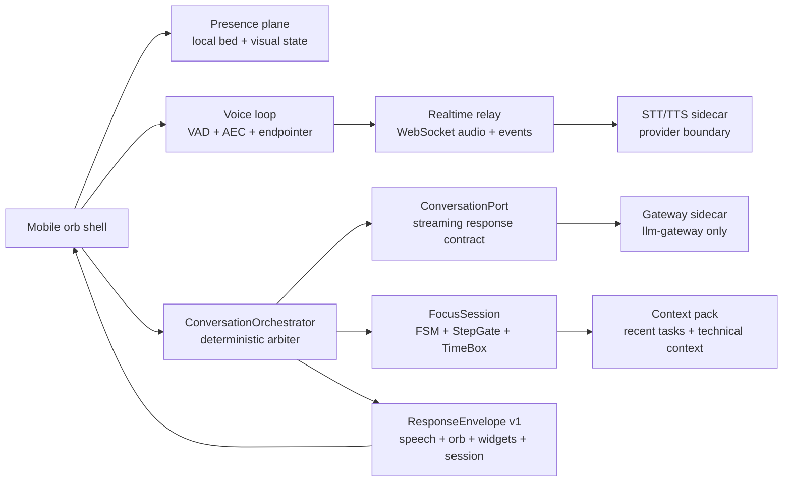

# Focus Orb — L8 Implementation Detail

Status: implementation contract and engineering plan
Owner: Focus Orb product / mobile + realtime voice + relay + gateway
Scope: connection presence, pure voice conversation, coding-task discussion, ADHD task execution, five-minute time boxes, and ChatGPT-Voice-level quality targets

This document turns the product requirement into executable boundaries, contracts, latency budgets, and proof gates. It is intentionally more specific than `docs/ORB-BODY-DOUBLE-CONVERSATIONAL-OS.md`: that document defines the product behavior; this document defines how the runtime must implement and prove it.

For the model decision, golden dataset, judge calibration, and release thresholds, use [`docs/LLM-SELECTION-AND-EVALS.md`](LLM-SELECTION-AND-EVALS.md).
For external voice interaction patterns and the Focus Orb adaptation, use [`docs/INTERACTION-MODELS-RESEARCH.md`](INTERACTION-MODELS-RESEARCH.md).

## 1. Product contract

The orb has three user-visible modes. They share one voice connection but do not share authority.

| Mode | User experience | System authority |
|---|---|---|
| `PRESENT` | The orb is active, greets on connection, listens when invited, and can remain quietly present. | Presence lifecycle only. No task is created. |
| `CONVERSE` | The user discusses technical work, asks questions, explores options, and receives clarifying questions while the orb reasons. | Conversation orchestrator may produce language and questions. It cannot mutate task state. |
| `FOCUS` | The user says they are starting a task. The orb creates a bounded todo plan, gives one step, shows a time box when needed, verifies completion, and advances only on explicit evidence. | Deterministic task FSM, step gate, timer, and policy. The model supplies bounded content only. |

The central invariant is:

> The model may suggest language, a question, or a plan candidate. Deterministic code decides whether the system is in `PRESENT`, `CONVERSE`, or `FOCUS`, whether a step is complete, whether a timer has expired, whether the orb may interrupt, and whether the session may end.

### Required user journeys

1. **Connection greeting**

   When a voice connection becomes usable, the orb says a short cached greeting immediately. It does not wait for the model, context retrieval, or task atomization. Reconnects are idempotent: one connection attempt produces at most one greeting.

2. **Technical conversation**

   The user can say “help me think through this architecture”, “why is this failing?”, “explain this file”, “review this approach”, or “what should I implement next?”. The orb keeps a compact technical discussion context and answers with evidence labels:

   - `observed`: directly supplied by the user, workspace context, or a tool result;
   - `inferred`: a bounded hypothesis that needs confirmation;
   - `proposed`: a design or next action, not a fact.

   If required context is missing, it asks one precise question rather than inventing a repository, file, error, or test result.

3. **Thinking and clarification**

   When a response needs a remote model, the voice loop emits a short local backchannel or progress phrase only when the turn is still active after the local latency threshold. The response pipeline may ask a clarifying question as its first useful utterance. It must never speak generic “thinking” filler repeatedly, and a clarifying question must not mutate the pending task.

4. **Pure conversation**

   Conversation is not an implicit task. “I had a rough morning”, “tell me about this error”, and “let’s brainstorm” remain conversational. The orb must not atomize, start a timer, or claim progress unless the user explicitly enters focus mode or uses an unambiguous task-start phrase.

5. **ADHD task execution**

   On an explicit task-start intent, the orb creates a todo list of atomic steps and immediately presents exactly one current step. Each step is executable in five minutes or less. A step that would take longer is split into multiple steps; it is never represented as one ten- or fifteen-minute instruction.

   For a step requiring a time box, the orb shows a non-interactive visual countdown around the orb and says the duration aloud. The default surface remains orb-first; the timer is a visual progress ring with an optional `mm:ss` accessibility label, not a separate task-management screen.

   When the time box expires, the orb asks: “Five minutes are up. Is that step done?” It never infers completion from elapsed time, silence, or the absence of a complaint.

   - `done` → mark the current step complete and speak the next step;
   - `not_done` → keep the same step, ask what is blocking it, or shrink it once;
   - `blocked` → enter support conversation without losing the current step;
   - ambiguous → ask one confirmation question and do not advance.

6. **Broader conversational cases**

   The runtime must support greeting, presence, technical explanation, debugging, design trade-offs, planning, code review, correction, topic change, “I do not know what to do”, waiting on a build or provider, overwhelm, interruption, silence, provider failure, reconnect, and explicit pause. All cases must preserve the active task and current step unless the user explicitly changes them.

## 2. Registry and placement decision

Registry decision: **install existing capabilities; build the product-specific orchestration in the domain/app boundary; extract only after a second product needs it.**

- Install and use `@pe/voice-realtime` and `@pe/realtime-voice` for realtime voice contracts and T0 adapters.
- Install and use `@pe/llm-gateway` through `backend/gateway-sidecar`; no mobile, relay, or domain code imports a provider SDK (**C9**).
- Install and use `@pe/cost-control-plane` for reservation-before-spend and session accounting (**C12**, **INV5**).
- Keep ADHD-specific intervention policy, coding conversation rules, time-box semantics, and prompt versions in this product’s `domain/` pack (**C2**, **L7**).
- Build the first `ConversationOrchestrator`, `TechnicalContextPack`, and `FocusTimeBox` inside the product runtime. If a second app needs the same contracts, extract them into a registry feature rather than copying them (**C1**, **L2**).

No new provider, speech, timer, or model dependency is added without an ADR (**C3**).

## 3. Runtime architecture



### 3.1 Presence plane

The presence plane remains independent from network and cognitive code. It owns:

- audio-bed creation, looping, ducking, interruption recovery, and the zero-gap watchdog;
- connection-ready visual state;
- cached greeting playback and greeting de-duplication;
- timer-ring rendering without deciding task state.

The bed is created once and remains audible except for explicit pause/session end. A relay failure changes the orb to `degraded` and starts repair behavior; it does not make the bed silent (**INV1**).

### 3.2 Voice plane

`VoiceLoopController` remains the single client turn arbiter for mic frames, partial transcripts, semantic endpointing, barge-in, and TTS cancellation. Add these rules:

- every user turn gets a `turn_id` and cancellation token;
- a newer user turn cancels the older response before it can speak;
- `final_transcript` is processed once; a local VAD endpoint never creates a second synthetic transcript;
- TTS starts from the first validated audio chunk, not after the full response is buffered;
- barge-in stops model generation, TTS playback, and pending time-box speech within 100ms;
- connection lifecycle events are separate from task events.

### 3.3 Conversation plane

Add `ConversationOrchestrator.ts` between `T0FocusSession` and the current `ConversationPort`. It owns no provider SDK and no React state. Its responsibilities are:

1. classify the user turn with rule-first logic;
2. choose the current mode using explicit transitions;
3. assemble a bounded context pack;
4. issue a local response, a cached response, or a streaming conversation request;
5. validate model output against a response schema;
6. hand language to the voice plane and decisions to deterministic handlers;
7. cancel stale work and preserve provenance.

The existing `ConversationPort` is the correct boundary, but the current HTTP request/JSON response is not sufficient for the target latency. Add a streaming sibling or versioned extension rather than making the existing synchronous path carry partial audio implicitly.

### 3.4 Focus plane

Keep `StateMachine.ts`, `StepGate.ts`, and the existing explicit completion invariants. Add a separate `FocusTimeBox` contract rather than overloading the policy-invoked `CheckInTimer`:

- `CheckInTimer` remains a policy intervention mechanism;
- `FocusTimeBox` represents a user-visible bounded work interval;
- both are cancellable and injected with a clock;
- neither can mark a step complete.

## 4. State model and transitions

Do not replace the existing nine-state task FSM. Add orthogonal connection and conversation state so a greeting or technical discussion does not force the task FSM into `INTAKE`.

```text
Connection: DISCONNECTED → CONNECTING → READY → DEGRADED → RECONNECTING
                         ↘ FAILED

Conversation: IDLE → LISTENING → CLASSIFYING → RESPONDING → WAITING_FOR_USER
                         ↑             ↓              ↓
                         └──── INTERRUPTED ←─────────┘

Task: IDLE_PRESENT → INTAKE → CLARIFY → STEP_PRESENT → WORKING
                                  ↑                         ↓
                                  └──── CONVERSE ← CHECK_IN
                                      WORKING → STEP_DONE → STEP_PRESENT | SESSION_DONE
```

The task FSM remains the authority for step progression. `CONVERSE` is an orchestration mode around the task session, not a new path that bypasses `StateMachine.ts`.

### Explicit transitions

| Event | Deterministic action |
|---|---|
| `connection_ready` | Mark connection ready, play one cached greeting, remain `PRESENT`. |
| `user_greeting` | Speak a short local response and wait. Do not ask for a task immediately. |
| `technical_question` | Enter `CONVERSE`; build technical context; answer or ask one missing-context question. |
| `start_work_intent` | Create a new immutable `TaskPlan`; enter `FOCUS`; present step 1. |
| `clarification_answer` | Update only clarification slots; never append the answer to the task text blindly. |
| `time_box_due` | Enter `CHECK_IN` only when the user is not speaking; ask explicit completion question. |
| `done_intent` | Advance only through `explicit_done_intent`; source the next step by index from `StepGate`. |
| `pause_intent` | Stop mic, close relay, pause timer, and preserve the plan for resume. |
| `barge_in` | Cancel outbound response, yield audio, return control to the user. |
| `provider_failure` | Speak a bounded repair message or cached phrase; keep the bed and current step alive. |

## 5. Contracts

### 5.1 Connection lifecycle

```ts
type ConnectionEvent =
  | { type: 'connecting'; connection_id: string; session_id: string }
  | { type: 'ready'; connection_id: string; at_ms: number }
  | { type: 'degraded'; reason: 'stt' | 'tts' | 'relay' | 'gateway' }
  | { type: 'reconnecting'; attempt: number; next_delay_ms: number }
  | { type: 'closed'; reason: 'pause' | 'user' | 'fatal' };

interface GreetingLease {
  readonly connection_id: string;
  readonly phrase_id: string;
  readonly issued_at_ms: number;
  readonly consumed: boolean;
}
```

`connection_id` is the de-duplication key. `session_id` is the conversation/task identity. A reconnect may reuse the session but must receive a new connection id and must not replay the greeting unless the reconnect policy explicitly says the user has been away long enough.

### 5.2 Technical discussion context

```ts
interface TechnicalContextPack {
  readonly topic_id: string;
  readonly objective: string | null;
  readonly repository: string | null;
  readonly files: readonly {
    path: string;
    line_start?: number;
    line_end?: number;
    content: string;
    source: 'user' | 'workspace' | 'tool_result';
  }[];
  readonly constraints: readonly string[];
  readonly decisions: readonly { decision: string; rationale: string; source: string }[];
  readonly open_questions: readonly string[];
  readonly evidence_refs: readonly string[];
  readonly token_budget: number;
}
```

The orb may discuss only the context it has. Workspace or tool access is opt-in, read-only by default, and each result carries a path/line or command provenance. No tool result is silently treated as a user fact.

### 5.3 Streaming conversation response

```ts
interface ConversationTurnRequest {
  readonly tenant_id: string;
  readonly user_id: string;
  readonly session_id: string;
  readonly turn_id: string;
  readonly mode: 'converse' | 'focus_support' | 'check_in';
  readonly transcript: string;
  readonly context: TechnicalContextPack;
  readonly active_task: string | null;
  readonly current_step_id: string | null;
  readonly prompt_version: string;
  readonly signal: AbortSignal;
}

type ConversationStreamEvent =
  | { type: 'ack'; phrase_id: string; cache: true }
  | { type: 'clarifying_question'; text: string; question_id: string }
  | { type: 'text_delta'; text: string }
  | { type: 'audio_chunk'; bytes: ArrayBuffer; seq: number }
  | { type: 'complete'; source: 'cache_hit' | 'reuse' | 'model'; latency_ms: number }
  | { type: 'error'; code: 'timeout' | 'budget' | 'provider' | 'invalid_output' };
```

The server must not return an unvalidated text stream directly to TTS. The gateway sidecar validates the response envelope, strips unknown speech markup, caps length/duration, and applies deterministic state-derived prosody.

### 5.4 Task plan and time box

```ts
interface TaskPlan {
  readonly plan_id: string;
  readonly task_text: string;
  readonly created_at_ms: number;
  readonly steps: readonly {
    step_id: string;
    index: number;
    text: string;
    done_signal: string;
    time_box_ms: number | null; // 60_000..300_000 when present
  }[];
  readonly current_index: number;
}

interface FocusTimeBox {
  readonly plan_id: string;
  readonly step_id: string;
  readonly started_at_ms: number;
  readonly due_at_ms: number;
  readonly status: 'running' | 'due' | 'deferred' | 'cancelled' | 'confirmed';
}
```

Validation rules:

- `steps_total` is 1–12;
- every step is one physical action and at most five minutes;
- `time_box_ms` is at most 300,000ms;
- a plan with a longer model estimate is split deterministically or repaired once;
- `done_signal` is observable and must not be the same as `text`;
- the plan is immutable except for step status, current index, and timer status;
- timer expiry never changes step status.

Add `focus_timer` to the known response widget set. It carries `plan_id`, `step_id`, `started_at_ms`, `due_at_ms`, and `status`; the client renders the ring from its injected monotonic clock. Server wall-clock timestamps are not used for animation.

### 5.5 Validated model output

```json
{
  "spoken_text": "I see two likely causes. Which file owns the relay connection?",
  "answer_kind": "clarify",
  "evidence": [
    {"kind": "observed", "text": "The relay is the only mobile voice network surface.", "ref": "RelayClient.ts"}
  ],
  "question": {"id": "q-17", "text": "Which file owns the relay connection?"},
  "proposed_next_action": null,
  "interruptible": true,
  "max_duration_ms": 4200
}
```

The model cannot emit `state`, `step_complete`, `session_done`, `timer_expired`, `provider`, `cost`, or `tool_permission`. Those fields are rejected if present. A response with invalid JSON, unsupported evidence, more than one question, or a duration over the cap falls back to a deterministic repair message.

## 6. Latency and capacity targets

These are service-level objectives, not adjectives. Measure from monotonic timestamps at each hop and report p50, p95, and p99 separately for cached, reuse, and model paths.

| Path | Target |
|---|---:|
| Audio bed audible after app/connection start | ≤120ms |
| Connection-ready visual state | ≤120ms |
| Cached greeting first audible sample | ≤250ms p95 |
| Barge-in yield / TTS stop | ≤100ms p95 |
| First STT partial after speech | ≤400ms p95 |
| Local intent classification | ≤10ms p99 |
| Cached clarification/backchannel | ≤100ms p95 |
| First conversational audio chunk | ≤600ms p50, ≤900ms p95 |
| Voice-to-voice turn completion | ≤1.1s p50, ≤2.0s p99 |
| Task atomization with immediate local filler | first useful speech ≤250ms; plan ≤2.0s p95 |
| Timer due event delivery | ≤100ms after due time when app is foregrounded |

Implementation requirements for the budget:

1. Open the relay, warm the context pack, and prewarm TTS concurrently.
2. Keep the first greeting in a local phrase manifest; never call the model for startup speech.
3. Use streaming STT, streaming gateway output, and chunked TTS. Do not wait for full text or a full WAV.
4. Route deterministic commands locally. Do not spend a model round trip on `done`, `next`, `pause`, or an unambiguous timer answer.
5. Start atomization asynchronously with a bounded cached acknowledgement; do not block the presence bed or microphone.
6. Cancel stale requests on barge-in, task change, pause, timeout, or reconnect.
7. Keep context packs bounded and precomputed. Retrieval is lexical first, then a real embedding similarity; a constant embedding is not acceptable evidence of reuse.

At the Phase 1 rung, size for 20,000 users with thin cloud and T0 memory adapters. A production capacity model must include concurrent open sockets, audio ingress Mbps, STT seconds, TTS characters, model tokens, relay CPU, and provider quotas. Every number must be replayed from load evidence (**L7**).

## 7. Coding-oriented behavior

The orb is a pocket L8 engineer, not a generic coding chatbot. Its response policy is:

- lead with the next action;
- separate evidence, inference, and proposal;
- use `Failure → Cause → Fix` for debugging;
- ask for one missing artifact at a time: path, error, command, expected behavior, or runtime evidence;
- prefer a small reversible change and a verification command;
- never claim a test passed, a file was inspected, or a provider was contacted without evidence;
- preserve the user’s current goal and avoid turning a discussion into a task plan until the user says to start working;
- when a plan is requested, state the registry decision, dependency direction, contracts, bottleneck, latency/cost budget, and proof gate;
- when the user is overwhelmed, compress to one concrete action and defer design detail;
- at the end of a turn, leave exactly one next action or one precise question.

Conversation prompts must be versioned under `domain/agents/` and evaluated against technical cases covering architecture, debugging, code review, API design, data modeling, performance, security, reliability, and deployment. The model may reason over supplied code, but repository access and mutation are separate explicit capabilities.

## 8. Failure behavior

| Failure | Cause | Fix / spoken behavior |
|---|---|---|
| No greeting | TTS/relay not ready or duplicate lifecycle event | Play cached local greeting; emit one `greeting_degraded` event; keep connection alive. |
| Silent thinking gap | Model call blocks before first audio | Emit one bounded local acknowledgement, then stream the first validated question/chunk. |
| Clarification pollutes task | Raw answer appended to `intakeTask` | Keep `pending_task` immutable; merge only validated slots; add a regression replay. |
| False task start | Conversation phrase classified as work | Require explicit start-work evidence; stay in `CONVERSE` for ambiguous language. |
| False completion | Timer/silence interpreted as done | Only `explicit_done_intent` can enter `STEP_DONE`. |
| Timer interrupts speech | Due event ignores conversation ownership | Mark timer `deferred`; ask at the next safe boundary. |
| Hallucinated code fact | Missing source or stale context | Speak uncertainty, request the exact artifact, and attach evidence refs. |
| Provider outage | STT/TTS/gateway unavailable | Preserve the bed and task plan, speak a cached repair phrase, retry once with backoff, then wait. |
| Barge-in duplicate response | Old stream completes after cancellation | Check turn generation and abort signal before every audio chunk. |
| Context reuse is wrong | Weak/constant embedding or stale session id | Use real bounded retrieval scores, new session ids, provenance, and a tenant/session replay. |

## 9. Privacy, safety, and operational requirements

- Carry `tenant_id`, `user_id`, `session_id`, `connection_id`, `turn_id`, and `trace_id` through every boundary (**C8**, **T13**).
- Store the minimum transcript needed for the live session. Raw audio is not persisted by default. Debug logs use redacted/truncated text or hashes and are disabled in release builds.
- Workspace/code access is read-only and opt-in. No shell command, file write, deployment, or external message is executed from speech without a separate explicit capability and confirmation.
- Crisis handling remains deterministic and short-circuits ordinary conversation. Safety copy requires human review before release.
- Cost reservation happens before every paid STT/TTS/LLM operation. Each response records `source`, model version, prompt version, usage, latency, and paise cost (**INV5**, **C12**).
- Model/prompt/voice changes require evals and a pinned version; no silent provider/model change (**C11**, **C16**).
- The orb must support explicit pause, mute, disconnect, transcript deletion, and “do not proactively speak”. These actions outrank all proactive policy.

## 10. Observability

Every turn emits structured events with no raw audio:

```text
orb.connection.started
orb.connection.ready
orb.greeting.requested
orb.greeting.played
orb.voice.first_partial
orb.voice.endpointed
orb.conversation.classified
orb.conversation.first_audio
orb.conversation.completed
orb.conversation.cancelled
orb.task.plan_created
orb.task.step_presented
orb.timer.armed
orb.timer.due
orb.timer.check_in_spoken
orb.task.completion_confirmed
orb.voice.gap
orb.provider.degraded
orb.cost.reserved
orb.cost.settled
```

Required dimensions: tenant/session/connection/turn IDs, mode, state before/after, source, provider route, prompt/model version, bytes/chars/tokens, cost paise, and hop latency. Histograms must expose the user-perceived path, not only server handler time.

## 11. Engineering process

Each slice follows the repository’s contract-first L8 loop:

1. **Write the contract suite first.** Add deterministic tests for lifecycle, mode arbitration, cancellation, timer semantics, and schema rejection before implementation (**T1/T2**).
2. **Implement one boundary.** Keep the write scope to one slice and add the real production caller in the same change.
3. **Run local deterministic proof.** `npm run verify`, replay tests, cost replay, and consistency checks.
4. **Run integrated audio proof.** Exercise mobile → relay → STT → orchestrator → gateway → TTS with captured hop timings.
5. **Run device proof.** Verify greeting, bed continuity, barge-in, timer ring, timer speech, and provider failure on Android and iOS where toolchains permit.
6. **Run voice-to-voice evals.** Text-only tests cannot prove audible quality, interruption quality, or latency.
7. **Record evidence and gaps.** Separate automated, emulator, provider, simulator, and physical-device evidence. Never promote a scaffold or fake adapter as production proof.

### Delivery slices

| Slice | Boundary | Exit evidence |
|---|---|---|
| A | Connection lifecycle + greeting lease | One greeting per connection, ≤250ms p95, reconnect and provider-degraded evidence |
| B | Conversation orchestrator + streaming port | Technical corpus, clarification behavior, cancellation, first-audio latency |
| C | Technical context pack | Evidence refs, stale-session isolation, no-hallucination replay |
| D | Five-minute atomizer + focus time box | All steps ≤5min, visible timer, due check-in, explicit completion only |
| E | Unified interrupt/reconnect path | Barge-in ≤100ms, no duplicate response, no bed gap |
| F | Quality/cost/rollout gates | Voice-to-voice thresholds, cost replay, canary dashboard, rollback flag |

Do not combine all slices into one implementation. The first slice to build is **A: connection lifecycle + greeting lease**, because an orb that is not audibly present cannot validate any higher-level conversation or ADHD behavior.

## 12. Acceptance gates

The feature is not complete until all gates are green and the evidence is attached:

- **Presence:** zero unplanned bed gaps; greeting is audible after every eligible connection; pause/mute is immediate and authoritative.
- **Conversation:** the orb answers technical questions, asks precise clarifying questions, preserves context, and does not create a task from ordinary conversation.
- **Task:** every plan has bounded steps; exactly one step is active; timer expiry asks for explicit confirmation; no false completion or skipped step is possible.
- **Voice:** first audio, p95/p99 turn latency, endpointing, barge-in, TTS chunk continuity, and provider degradation are measured voice-to-voice.
- **Correctness:** schema-invalid model output, stale session, wrong tenant, missing code evidence, and cancelled stream all fail closed.
- **Cost:** every paid operation is reserved and settled; T0 paths are labelled as T0; no fake cache/reuse/latency claim is accepted.
- **Operations:** logs, traces, alerts, runbook, prompt/model versions, and rollback flags exist before canary.

The quality bar is “ChatGPT Voice-like” only when these gates are measured on the actual mobile audio path. It is not a claim that can be established by prompt quality or unit tests alone.

## 13. Current implementation deltas to close

The current code provides a strong foundation but does not yet satisfy this contract end to end:

1. `T0FocusSession.start()` currently dispatches directly into task intake. Connection greeting must become an orthogonal lifecycle event so startup greeting does not create an implicit task.
2. `ConversationPort` exists, and relay-py exposes `/v1/respond`, but the path is synchronous JSON. Add streaming response/audio events and cancellation for the low-latency target.
3. `CLARIFY` needs an immutable pending-task field and a replay proving that clarification answers cannot pollute the task sent to `/v1/atomize`.
4. `simpleEmbedding()` is currently not a valid retrieval signal. Replace it with a deterministic bounded embedding or remove cosine reuse until a real embedding adapter exists.
5. `ResponseEnvelope` needs a versioned timer widget and conversation metadata sufficient to render a timer without letting the UI decide completion.
6. `CheckInTimer` is policy-driven and must remain so; implement `FocusTimeBox` separately for the user-requested five-minute countdown.
7. The production voice failure path currently records `native_tts_fallback: false`; the greeting path needs a cached-audio fallback so connection startup never becomes silent when the provider is unavailable.
8. `speakCurrentStep()` and all envelope constructors must preserve the actual response provenance (`model`, `reuse`, `cache_hit`) instead of hardcoding a source.

These are implementation deltas, not permission to weaken the existing presence, determinism, tenant, cost, or evidence invariants.
